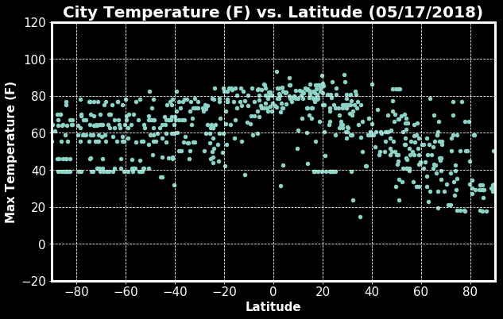
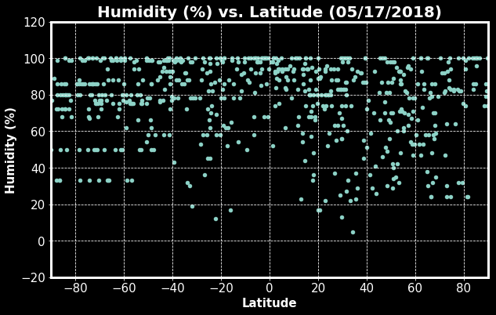
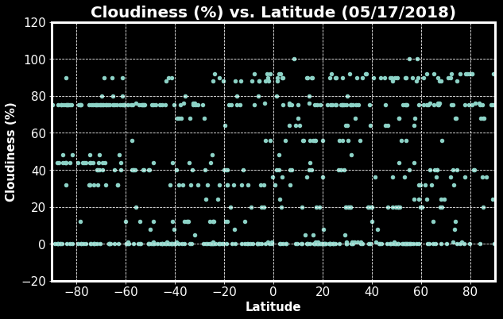
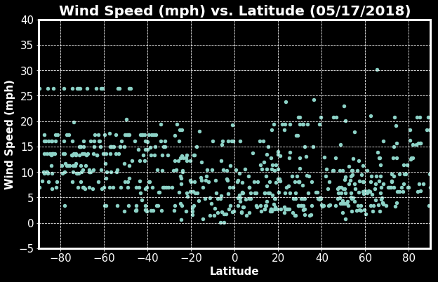

# WeatherPy

Analysis:
* Observed trend 1: Max temperatures of cities are generally higher with less variance when latitudes come closer to the equator. With the same absolute value of latitudes, the northern part has a higher average of max temperatures than the southern part.
* Observed trend 2: Cloudiness is similar across all latitudes.
* Observed trend 3: The minimum wind speed of a latitude is smaller when latitudes come closer to the equator. 


```python
# dependencies
from citipy import citipy
from random import uniform
from config import api_key
import requests
import numpy
import matplotlib
import matplotlib.pyplot as plt
import pandas as pd

# base_url
base_url = "http://api.openweathermap.org/data/2.5/weather?"
```

# Generate Cities List


```python
# generate random latitudes and longitudes
total = 700
lat_samples = [numpy.random.uniform(-90, 90) for i in range(total)]
lon_samples = [numpy.random.uniform(-180, 180) for i in range(total)]

# prepare lists for storing data
result_samples = []
city_samples = []
country_samples = []

# iterate through cities
for i in range(total):
    lat = lat_samples[i]
    lon = lon_samples[i]

    # find the nearest city to that pair of coordinates
    # find the city name and country code
    result = citipy.nearest_city(lat, lon)
    city = result.city_name
    country = result.country_code

    # append data to lists
    result_samples.append(result)
    city_samples.append(city)
    country_samples.append(country)

city_samples
```


    ['longyearbyen',
     'rikitea',
     'souillac',
     'amderma',
     'humaita',
     'jawhar',
     'illoqqortoormiut',
     'airai',
     'pa sang',
     'rikitea',
     'atar',
     'taolanaro',
     'illoqqortoormiut',
     'lantawan',
     'punta arenas',
     'ushuaia',
     'fairbanks',
     'charlestown',
     'sao bernardo',
     'severnyy-kospashskiy',
     'itapuranga',
     'yellowknife',
     'bilma',
     'ituni',
     'vaitupu',
     'aklavik',
     'punta arenas',
     'arona',
     'bambous virieux',
     'tasiilaq',
     'hamilton',
     'hilo',
     'taltal',
     'rio branco do sul',
     'kapaa',
     'hamilton',
     'hilo',
     'bengkulu',
     'dikson',
     'ushuaia',
     'amderma',
     'lazaro cardenas',
     'hilo',
     'khatanga',
     'bogande',
     'mataura',
     'lebu',
     'babanusah',
     'barentsburg',
     'chuy',
     'byron bay',
     'bulanash',
     'lavrentiya',
     'stelle',
     'paamiut',
     'ribeira grande',
     'indianola',
     'derzhavinsk',
     'east london',
     'avarua',
     'salalah',
     'hamilton',
     'rikitea',
     'new norfolk',
     'isangel',
     'ponta do sol',
     'puerto ayora',
     'kungurtug',
     'lasa',
     'amderma',
     'vaini',
     'harper',
     'rikitea',
     'le port',
     'busselton',
     'ribeira grande',
     'punta arenas',
     'ponta do sol',
     'itaituba',
     'billings',
     'asht',
     'kuantan',
     'biak',
     'zhigansk',
     'avarua',
     'clyde river',
     'barentsburg',
     'micheweni',
     'tautira',
     'lesnoye',
     'faya',
     'tuatapere',
     'sentyabrskiy',
     'jamestown',
     'bathsheba',
     'atuona',
     'ayan',
     'ponta do sol',
     'bandar maharani',
     'ushuaia',
     'las cruces',
     'new norfolk',
     'busselton',
     'harper',
     'wuwei',
     'kapaa',
     'ilulissat',
     'sur',
     'egvekinot',
     'hervey bay',
     'georgetown',
     'busselton',
     'hobart',
     'yulara',
     'cherskiy',
     'great yarmouth',
     'kandrian',
     'marcona',
     'belushya guba',
     'huicungo',
     'hithadhoo',
     'haines junction',
     'port alfred',
     'bluff',
     'vaini',
     'sitka',
     'miyang',
     'gerash',
     'ponta do sol',
     'yurla',
     'ushuaia',
     'annau',
     'pyshma',
     'pevek',
     'atasu',
     'yumen',
     'kapaa',
     'new norfolk',
     'grindavik',
     'bluff',
     'hamilton',
     'carnarvon',
     'cape town',
     'hilo',
     'yellowknife',
     'kruisfontein',
     'alice springs',
     'busselton',
     'cape elizabeth',
     'hermanus',
     'comodoro rivadavia',
     'cape town',
     'los llanos de aridane',
     'lebu',
     'bluff',
     'kavaratti',
     'guelengdeng',
     'beringovskiy',
     'nicoya',
     'faanui',
     'hasaki',
     'vaini',
     'plotnikovo',
     'albany',
     'mataura',
     'khatanga',
     'padang',
     'wahran',
     'busselton',
     'hermanus',
     'port alfred',
     'hofn',
     'puerto ayora',
     'barrow',
     'taburi',
     'busselton',
     'tombouctou',
     'nikolskoye',
     'atuona',
     'yenagoa',
     'pevek',
     'edd',
     'constitucion',
     'jamestown',
     'hermanus',
     'ushuaia',
     'bluff',
     'avarua',
     'grand gaube',
     'hobart',
     'muros',
     'lata',
     'dikson',
     'albany',
     'ushuaia',
     'conakry',
     'saint george',
     'norman wells',
     'longyearbyen',
     'bengkulu',
     'grants',
     'illoqqortoormiut',
     'hithadhoo',
     'ribeira grande',
     'sobolevo',
     'atuona',
     'immokalee',
     'quelimane',
     'victoria',
     'bredasdorp',
     'banda aceh',
     'marcona',
     'kenai',
     'nago',
     'vaitupu',
     'nanortalik',
     'umzimvubu',
     'albany',
     'wuhu',
     'lolua',
     'tuktoyaktuk',
     'vaini',
     'honningsvag',
     'vila franca do campo',
     'bredasdorp',
     'zharkent',
     'lakes entrance',
     'thompson',
     'ushuaia',
     'mar del plata',
     'hit',
     'hilo',
     'hermanus',
     'bambanglipuro',
     'east london',
     'walvis bay',
     'cayenne',
     'nikolskoye',
     'airai',
     'bilibino',
     'vaini',
     'ushuaia',
     'ilulissat',
     'rikitea',
     'kamenskoye',
     'saskylakh',
     'christchurch',
     'ponta do sol',
     'jamestown',
     'kahului',
     'saldanha',
     'waipawa',
     'santa fe',
     'nikolskoye',
     'cidreira',
     'cape town',
     'ushuaia',
     'wanning',
     'bluff',
     'mana',
     'busselton',
     'rikitea',
     'clyde river',
     'vila franca do campo',
     'lompoc',
     'castro',
     'iralaya',
     'hermanus',
     'klaksvik',
     'vardo',
     'mataura',
     'ushuaia',
     'barentsburg',
     'busselton',
     'punta arenas',
     'east london',
     'denia',
     'qaanaaq',
     'bambous virieux',
     'mataura',
     'vaini',
     'eyl',
     'ha tinh',
     'ponta do sol',
     'vaini',
     'new norfolk',
     'attawapiskat',
     'pisco',
     'pisco',
     'ponta do sol',
     'kutum',
     'belushya guba',
     'chuy',
     'punta arenas',
     'mackay',
     'vardo',
     'deer lake',
     'saskylakh',
     'deputatskiy',
     'grindavik',
     'grindavik',
     'yuzhno-yeniseyskiy',
     'luderitz',
     'bredasdorp',
     'cape town',
     'cidreira',
     'portland',
     'taolanaro',
     'mariental',
     'airai',
     'baruun-urt',
     'busselton',
     'nanakuli',
     'ushuaia',
     'mataura',
     'talnakh',
     'hilo',
     'barentsburg',
     'fortuna',
     'bluff',
     'castro',
     'skibbereen',
     'graciano sanchez',
     'taolanaro',
     'haines junction',
     'trairi',
     'kapaa',
     'la foa',
     'mataura',
     'fortuna',
     'rikitea',
     'jamestown',
     'sundarnagar',
     'vaitupu',
     'illoqqortoormiut',
     'aleksandrov gay',
     'port alfred',
     'port elizabeth',
     'adrar',
     'kahului',
     'rikitea',
     'dunedin',
     'alofi',
     'ponta do sol',
     'kapaa',
     'busselton',
     'belushya guba',
     'mahibadhoo',
     'albany',
     'saskylakh',
     'tigil',
     'puerto ayora',
     'saskylakh',
     'khatanga',
     'thompson',
     'itoman',
     'batken',
     'ushuaia',
     'busselton',
     'hobart',
     'samusu',
     'nizhneyansk',
     'bluff',
     'cidreira',
     'udachnyy',
     'port elizabeth',
     'rikitea',
     'bethel',
     'paradwip',
     'ponta do sol',
     'ornskoldsvik',
     'bambous virieux',
     'sitka',
     'east london',
     'souillac',
     'nome',
     'teguise',
     'punta arenas',
     'ushuaia',
     'bengkulu',
     'gizo',
     'chuy',
     'longyearbyen',
     'attawapiskat',
     'chuy',
     'mataura',
     'hobart',
     'port alfred',
     'rikitea',
     'mendi',
     'busselton',
     'hamilton',
     'belushya guba',
     'dikson',
     'ushuaia',
     'butaritari',
     'matara',
     'kholm',
     'boyuibe',
     'richards bay',
     'hobart',
     'rikitea',
     'sinnamary',
     'kodiak',
     'nikolskoye',
     'kovdor',
     'bluff',
     'srednekolymsk',
     'arraial do cabo',
     'provideniya',
     'contai',
     'thai binh',
     'grand-lahou',
     'hithadhoo',
     'katangli',
     'ushuaia',
     'tuktoyaktuk',
     'ucluelet',
     'lieksa',
     'barrow',
     'bethel',
     'chernyshevskiy',
     'cape town',
     'vysokaya gora',
     'new norfolk',
     'butaritari',
     'tiksi',
     'yellowknife',
     'codrington',
     'sarrebourg',
     'punta arenas',
     'ixtapa',
     'paamiut',
     'bluff',
     'moyobamba',
     'san patricio',
     'busselton',
     'jamestown',
     'albany',
     'hermanus',
     'saint-philippe',
     'tuktoyaktuk',
     'zhanaozen',
     'dingle',
     'pangnirtung',
     'leshukonskoye',
     'mataura',
     'tasiilaq',
     'seoul',
     'kavaratti',
     'tarauaca',
     'hithadhoo',
     'ushuaia',
     'pimentel',
     'kaitangata',
     'sagamihara',
     'drumheller',
     'luderitz',
     'cape town',
     'punta arenas',
     'atuona',
     'yangjiang',
     'puerto carreno',
     'punta arenas',
     'mahebourg',
     'sydney',
     'college',
     'hilo',
     'hobbs',
     'belushya guba',
     'aflu',
     'kapaa',
     'saint george',
     'georgetown',
     'albany',
     'lagoa',
     'busselton',
     'vaini',
     'kalas',
     'wuwei',
     'hilo',
     'hermosillo',
     'rikitea',
     'ewa beach',
     'illoqqortoormiut',
     'anchorage',
     'arraial do cabo',
     'nokaneng',
     'calbuco',
     'busselton',
     'pavlodar',
     'port alfred',
     'hilo',
     'elko',
     'albany',
     'port alfred',
     'busselton',
     'saint-georges',
     'okato',
     'punta arenas',
     'rocha',
     'ternate',
     'garmsar',
     'xinqing',
     'terra santa',
     'san quintin',
     'rikitea',
     'takob',
     'atuona',
     'jamestown',
     'busselton',
     'kapaa',
     'dicabisagan',
     'geraldton',
     'albany',
     'ponta do sol',
     'hithadhoo',
     'sao joao da barra',
     'port elizabeth',
     'busselton',
     'ponta do sol',
     'saint-philippe',
     'varca',
     'dunboyne',
     'bethel',
     'butaritari',
     'ushuaia',
     'qaanaaq',
     'harpanahalli',
     'saint george',
     'luderitz',
     'olafsvik',
     'palmer',
     'saint-philippe',
     'guerrero negro',
     'kenora',
     'north myrtle beach',
     'yellowknife',
     'norman wells',
     'palu',
     'manggar',
     'uyemskiy',
     'tonantins',
     'atuona',
     'avera',
     'cidreira',
     'bredasdorp',
     'san carlos de bariloche',
     'dingle',
     'busselton',
     'barbar',
     'samusu',
     'urdzhar',
     'hobart',
     'hobart',
     'barrow',
     'hobart',
     'cockburn town',
     'mahebourg',
     'bredasdorp',
     'acapulco',
     'los llanos de aridane',
     'saleaula',
     'victoria',
     'ribeira grande',
     'atuona',
     'esperance',
     'calama',
     'vaini',
     'joshimath',
     'namibe',
     'busselton',
     'mar del plata',
     'puerto ayora',
     'illoqqortoormiut',
     'thompson',
     'iqaluit',
     'barrow',
     'leningradskiy',
     'padang',
     'ushuaia',
     'leh',
     'port alfred',
     'cayenne',
     'provideniya',
     'bluff',
     'sola',
     'kismayo',
     'dingle',
     'upernavik',
     'torbay',
     'punta arenas',
     'amderma',
     'boa vista',
     'hermanus',
     'mataura',
     'norman wells',
     'rikitea',
     'bluff',
     'port elizabeth',
     'labuhan',
     'albany',
     'nangomba',
     'dingle',
     'hilo',
     'palasa',
     'mataura',
     'ulaangom',
     'umzimvubu',
     'saleaula',
     'mayo',
     'mataura',
     'helong',
     'ribeira grande',
     'rikitea',
     'albany',
     'bethel',
     'fairlie',
     'les ponts-de-ce',
     'el dorado',
     'itaituba',
     'rikitea',
     'vulcan',
     'dakar',
     'port elizabeth',
     'baherden',
     'tarma',
     'turukhansk',
     'new norfolk',
     'punta arenas',
     'ushuaia',
     'butaritari',
     'tautira',
     'new norfolk',
     'saldanha',
     'bur gabo',
     'hermanus',
     'butaritari',
     'beringovskiy',
     'albany',
     'padilla',
     'yellowknife',
     'ushuaia',
     'lebu',
     'rungata',
     'nikolskoye',
     'okha',
     'chokurdakh',
     'lebu',
     'bengkulu',
     'sabang',
     'hermanus',
     'los llanos de aridane',
     'barrow',
     'blackwater',
     'rikitea',
     'sept-iles',
     'oxelosund',
     'jamestown',
     'qaanaaq',
     'drayton valley',
     'matamoros',
     'mataura',
     'yellowknife',
     'bambous virieux',
     'hithadhoo',
     'busselton',
     'albany',
     'punta arenas',
     'jamestown',
     'alice springs',
     'puerto ayora',
     'barrow',
     'nyurba',
     'chokurdakh',
     'avarua',
     'hobart',
     'namatanai',
     'nouadhibou',
     'yerofey pavlovich',
     'lasa',
     'dese',
     'saint-augustin',
     'yeletskiy',
     'barroualie',
     'kiruna',
     'homer',
     'bilma',
     'qaanaaq',
     'lorengau',
     'stoyba',
     'avarua',
     'rotherham',
     'karratha',
     'arraial do cabo',
     'fortuna',
     'pierre',
     'ponta do sol',
     'hermanus',
     'touros']


# Perform API Calls


```python
# test to get response for one city
city = "paris"
params = {"appid" : api_key, "q" : city, "units" : "imperial"}
response = requests.get(base_url, params)
data = response.json()
```


```python
# iterate through cities and perform API calls
data_list = []
city_list = []
country_list = []
date_list = []
lat_list = []
lon_list = []
cloudiness_list = []
humidity_list = []
temp_list = []
wind_speed_list = []
n = 0

# loop through cities to make api calls
for i in range(total):
    city = city_samples[i]
    params = {"appid" : api_key, "q" : city, "units" : "imperial"}
    response = requests.get(base_url, params)
    
    # only store data into lists when there is response
    if(response):
        data = response.json()
        data_list.append(data)
        
        # append data to lists
        city_list.append(city)
        country_list.append(data["sys"]["country"])
        date_list.append(data["dt"])
        lat_list.append(lat_samples[i])
        lon_list.append(lon_samples[i])
        data_list.append(data)
        cloudiness_list.append(data["clouds"]["all"])
        humidity_list.append(data["main"]["humidity"])
        temp_list.append(data["main"]["temp_max"])
        wind_speed_list.append(data["wind"]["speed"])

        # print city number, name and url
        print(f"Processing Record {n%50+1} of Set {int(n/50+1)} | {city}")
        print(response.url)
        n += 1

```

    Processing Record 1 of Set 1 | longyearbyen
    http://api.openweathermap.org/data/2.5/weather?appid=f5577870a4fe514c0a6c56ee569c5c7b&q=longyearbyen&units=imperial
    Processing Record 2 of Set 1 | rikitea
    http://api.openweathermap.org/data/2.5/weather?appid=f5577870a4fe514c0a6c56ee569c5c7b&q=rikitea&units=imperial
    Processing Record 3 of Set 1 | souillac
    http://api.openweathermap.org/data/2.5/weather?appid=f5577870a4fe514c0a6c56ee569c5c7b&q=souillac&units=imperial
    Processing Record 4 of Set 1 | humaita
    http://api.openweathermap.org/data/2.5/weather?appid=f5577870a4fe514c0a6c56ee569c5c7b&q=humaita&units=imperial
    Processing Record 5 of Set 1 | jawhar
    http://api.openweathermap.org/data/2.5/weather?appid=f5577870a4fe514c0a6c56ee569c5c7b&q=jawhar&units=imperial
    Processing Record 6 of Set 1 | airai
    http://api.openweathermap.org/data/2.5/weather?appid=f5577870a4fe514c0a6c56ee569c5c7b&q=airai&units=imperial
    Processing Record 7 of Set 1 | pa sang
    http://api.openweathermap.org/data/2.5/weather?appid=f5577870a4fe514c0a6c56ee569c5c7b&q=pa+sang&units=imperial
    Processing Record 8 of Set 1 | rikitea
    http://api.openweathermap.org/data/2.5/weather?appid=f5577870a4fe514c0a6c56ee569c5c7b&q=rikitea&units=imperial
    Processing Record 9 of Set 1 | atar
    http://api.openweathermap.org/data/2.5/weather?appid=f5577870a4fe514c0a6c56ee569c5c7b&q=atar&units=imperial
    Processing Record 10 of Set 1 | lantawan
    http://api.openweathermap.org/data/2.5/weather?appid=f5577870a4fe514c0a6c56ee569c5c7b&q=lantawan&units=imperial
    Processing Record 11 of Set 1 | punta arenas
    http://api.openweathermap.org/data/2.5/weather?appid=f5577870a4fe514c0a6c56ee569c5c7b&q=punta+arenas&units=imperial
    Processing Record 12 of Set 1 | ushuaia
    http://api.openweathermap.org/data/2.5/weather?appid=f5577870a4fe514c0a6c56ee569c5c7b&q=ushuaia&units=imperial
    Processing Record 13 of Set 1 | fairbanks
    http://api.openweathermap.org/data/2.5/weather?appid=f5577870a4fe514c0a6c56ee569c5c7b&q=fairbanks&units=imperial
    Processing Record 14 of Set 1 | charlestown
    http://api.openweathermap.org/data/2.5/weather?appid=f5577870a4fe514c0a6c56ee569c5c7b&q=charlestown&units=imperial
    Processing Record 15 of Set 1 | sao bernardo
    http://api.openweathermap.org/data/2.5/weather?appid=f5577870a4fe514c0a6c56ee569c5c7b&q=sao+bernardo&units=imperial
    Processing Record 16 of Set 1 | severnyy-kospashskiy
    http://api.openweathermap.org/data/2.5/weather?appid=f5577870a4fe514c0a6c56ee569c5c7b&q=severnyy-kospashskiy&units=imperial
    Processing Record 17 of Set 1 | itapuranga
    http://api.openweathermap.org/data/2.5/weather?appid=f5577870a4fe514c0a6c56ee569c5c7b&q=itapuranga&units=imperial
    Processing Record 18 of Set 1 | yellowknife
    http://api.openweathermap.org/data/2.5/weather?appid=f5577870a4fe514c0a6c56ee569c5c7b&q=yellowknife&units=imperial
    Processing Record 19 of Set 1 | bilma
    http://api.openweathermap.org/data/2.5/weather?appid=f5577870a4fe514c0a6c56ee569c5c7b&q=bilma&units=imperial
    Processing Record 20 of Set 1 | aklavik
    http://api.openweathermap.org/data/2.5/weather?appid=f5577870a4fe514c0a6c56ee569c5c7b&q=aklavik&units=imperial
    Processing Record 21 of Set 1 | punta arenas
    http://api.openweathermap.org/data/2.5/weather?appid=f5577870a4fe514c0a6c56ee569c5c7b&q=punta+arenas&units=imperial
    Processing Record 22 of Set 1 | arona
    http://api.openweathermap.org/data/2.5/weather?appid=f5577870a4fe514c0a6c56ee569c5c7b&q=arona&units=imperial
    Processing Record 23 of Set 1 | bambous virieux
    http://api.openweathermap.org/data/2.5/weather?appid=f5577870a4fe514c0a6c56ee569c5c7b&q=bambous+virieux&units=imperial
    Processing Record 24 of Set 1 | tasiilaq
    http://api.openweathermap.org/data/2.5/weather?appid=f5577870a4fe514c0a6c56ee569c5c7b&q=tasiilaq&units=imperial
    Processing Record 25 of Set 1 | hamilton
    http://api.openweathermap.org/data/2.5/weather?appid=f5577870a4fe514c0a6c56ee569c5c7b&q=hamilton&units=imperial
    Processing Record 26 of Set 1 | hilo
    http://api.openweathermap.org/data/2.5/weather?appid=f5577870a4fe514c0a6c56ee569c5c7b&q=hilo&units=imperial
    Processing Record 27 of Set 1 | taltal
    http://api.openweathermap.org/data/2.5/weather?appid=f5577870a4fe514c0a6c56ee569c5c7b&q=taltal&units=imperial
    Processing Record 28 of Set 1 | rio branco do sul
    http://api.openweathermap.org/data/2.5/weather?appid=f5577870a4fe514c0a6c56ee569c5c7b&q=rio+branco+do+sul&units=imperial
    Processing Record 29 of Set 1 | kapaa
    http://api.openweathermap.org/data/2.5/weather?appid=f5577870a4fe514c0a6c56ee569c5c7b&q=kapaa&units=imperial
    Processing Record 30 of Set 1 | hamilton
    http://api.openweathermap.org/data/2.5/weather?appid=f5577870a4fe514c0a6c56ee569c5c7b&q=hamilton&units=imperial
    Processing Record 31 of Set 1 | hilo
    http://api.openweathermap.org/data/2.5/weather?appid=f5577870a4fe514c0a6c56ee569c5c7b&q=hilo&units=imperial
    Processing Record 32 of Set 1 | dikson
    http://api.openweathermap.org/data/2.5/weather?appid=f5577870a4fe514c0a6c56ee569c5c7b&q=dikson&units=imperial
    Processing Record 33 of Set 1 | ushuaia
    http://api.openweathermap.org/data/2.5/weather?appid=f5577870a4fe514c0a6c56ee569c5c7b&q=ushuaia&units=imperial
    Processing Record 34 of Set 1 | lazaro cardenas
    http://api.openweathermap.org/data/2.5/weather?appid=f5577870a4fe514c0a6c56ee569c5c7b&q=lazaro+cardenas&units=imperial
    Processing Record 35 of Set 1 | hilo
    http://api.openweathermap.org/data/2.5/weather?appid=f5577870a4fe514c0a6c56ee569c5c7b&q=hilo&units=imperial
    Processing Record 36 of Set 1 | khatanga
    http://api.openweathermap.org/data/2.5/weather?appid=f5577870a4fe514c0a6c56ee569c5c7b&q=khatanga&units=imperial
    Processing Record 37 of Set 1 | bogande
    http://api.openweathermap.org/data/2.5/weather?appid=f5577870a4fe514c0a6c56ee569c5c7b&q=bogande&units=imperial
    Processing Record 38 of Set 1 | mataura
    http://api.openweathermap.org/data/2.5/weather?appid=f5577870a4fe514c0a6c56ee569c5c7b&q=mataura&units=imperial
    Processing Record 39 of Set 1 | lebu
    http://api.openweathermap.org/data/2.5/weather?appid=f5577870a4fe514c0a6c56ee569c5c7b&q=lebu&units=imperial
    Processing Record 40 of Set 1 | chuy
    http://api.openweathermap.org/data/2.5/weather?appid=f5577870a4fe514c0a6c56ee569c5c7b&q=chuy&units=imperial
    Processing Record 41 of Set 1 | byron bay
    http://api.openweathermap.org/data/2.5/weather?appid=f5577870a4fe514c0a6c56ee569c5c7b&q=byron+bay&units=imperial
    Processing Record 42 of Set 1 | bulanash
    http://api.openweathermap.org/data/2.5/weather?appid=f5577870a4fe514c0a6c56ee569c5c7b&q=bulanash&units=imperial
    Processing Record 43 of Set 1 | lavrentiya
    http://api.openweathermap.org/data/2.5/weather?appid=f5577870a4fe514c0a6c56ee569c5c7b&q=lavrentiya&units=imperial
    Processing Record 44 of Set 1 | stelle
    http://api.openweathermap.org/data/2.5/weather?appid=f5577870a4fe514c0a6c56ee569c5c7b&q=stelle&units=imperial
    Processing Record 45 of Set 1 | paamiut
    http://api.openweathermap.org/data/2.5/weather?appid=f5577870a4fe514c0a6c56ee569c5c7b&q=paamiut&units=imperial
    Processing Record 46 of Set 1 | ribeira grande
    http://api.openweathermap.org/data/2.5/weather?appid=f5577870a4fe514c0a6c56ee569c5c7b&q=ribeira+grande&units=imperial
    Processing Record 47 of Set 1 | indianola
    http://api.openweathermap.org/data/2.5/weather?appid=f5577870a4fe514c0a6c56ee569c5c7b&q=indianola&units=imperial
    Processing Record 48 of Set 1 | derzhavinsk
    http://api.openweathermap.org/data/2.5/weather?appid=f5577870a4fe514c0a6c56ee569c5c7b&q=derzhavinsk&units=imperial
    Processing Record 49 of Set 1 | east london
    http://api.openweathermap.org/data/2.5/weather?appid=f5577870a4fe514c0a6c56ee569c5c7b&q=east+london&units=imperial
    Processing Record 50 of Set 1 | avarua
    http://api.openweathermap.org/data/2.5/weather?appid=f5577870a4fe514c0a6c56ee569c5c7b&q=avarua&units=imperial
    Processing Record 1 of Set 2 | salalah
    http://api.openweathermap.org/data/2.5/weather?appid=f5577870a4fe514c0a6c56ee569c5c7b&q=salalah&units=imperial
    Processing Record 2 of Set 2 | hamilton
    http://api.openweathermap.org/data/2.5/weather?appid=f5577870a4fe514c0a6c56ee569c5c7b&q=hamilton&units=imperial
    Processing Record 3 of Set 2 | rikitea
    http://api.openweathermap.org/data/2.5/weather?appid=f5577870a4fe514c0a6c56ee569c5c7b&q=rikitea&units=imperial
    Processing Record 4 of Set 2 | new norfolk
    http://api.openweathermap.org/data/2.5/weather?appid=f5577870a4fe514c0a6c56ee569c5c7b&q=new+norfolk&units=imperial
    Processing Record 5 of Set 2 | isangel
    http://api.openweathermap.org/data/2.5/weather?appid=f5577870a4fe514c0a6c56ee569c5c7b&q=isangel&units=imperial
    Processing Record 6 of Set 2 | ponta do sol
    http://api.openweathermap.org/data/2.5/weather?appid=f5577870a4fe514c0a6c56ee569c5c7b&q=ponta+do+sol&units=imperial
    Processing Record 7 of Set 2 | puerto ayora
    http://api.openweathermap.org/data/2.5/weather?appid=f5577870a4fe514c0a6c56ee569c5c7b&q=puerto+ayora&units=imperial
    Processing Record 8 of Set 2 | kungurtug
    http://api.openweathermap.org/data/2.5/weather?appid=f5577870a4fe514c0a6c56ee569c5c7b&q=kungurtug&units=imperial
    Processing Record 9 of Set 2 | lasa
    http://api.openweathermap.org/data/2.5/weather?appid=f5577870a4fe514c0a6c56ee569c5c7b&q=lasa&units=imperial
    Processing Record 10 of Set 2 | vaini
    http://api.openweathermap.org/data/2.5/weather?appid=f5577870a4fe514c0a6c56ee569c5c7b&q=vaini&units=imperial
    Processing Record 11 of Set 2 | harper
    http://api.openweathermap.org/data/2.5/weather?appid=f5577870a4fe514c0a6c56ee569c5c7b&q=harper&units=imperial
    Processing Record 12 of Set 2 | rikitea
    http://api.openweathermap.org/data/2.5/weather?appid=f5577870a4fe514c0a6c56ee569c5c7b&q=rikitea&units=imperial
    Processing Record 13 of Set 2 | le port
    http://api.openweathermap.org/data/2.5/weather?appid=f5577870a4fe514c0a6c56ee569c5c7b&q=le+port&units=imperial
    Processing Record 14 of Set 2 | busselton
    http://api.openweathermap.org/data/2.5/weather?appid=f5577870a4fe514c0a6c56ee569c5c7b&q=busselton&units=imperial
    Processing Record 15 of Set 2 | ribeira grande
    http://api.openweathermap.org/data/2.5/weather?appid=f5577870a4fe514c0a6c56ee569c5c7b&q=ribeira+grande&units=imperial
    Processing Record 16 of Set 2 | punta arenas
    http://api.openweathermap.org/data/2.5/weather?appid=f5577870a4fe514c0a6c56ee569c5c7b&q=punta+arenas&units=imperial
    Processing Record 17 of Set 2 | ponta do sol
    http://api.openweathermap.org/data/2.5/weather?appid=f5577870a4fe514c0a6c56ee569c5c7b&q=ponta+do+sol&units=imperial
    Processing Record 18 of Set 2 | itaituba
    http://api.openweathermap.org/data/2.5/weather?appid=f5577870a4fe514c0a6c56ee569c5c7b&q=itaituba&units=imperial
    Processing Record 19 of Set 2 | billings
    http://api.openweathermap.org/data/2.5/weather?appid=f5577870a4fe514c0a6c56ee569c5c7b&q=billings&units=imperial
    Processing Record 20 of Set 2 | kuantan
    http://api.openweathermap.org/data/2.5/weather?appid=f5577870a4fe514c0a6c56ee569c5c7b&q=kuantan&units=imperial
    Processing Record 21 of Set 2 | biak
    http://api.openweathermap.org/data/2.5/weather?appid=f5577870a4fe514c0a6c56ee569c5c7b&q=biak&units=imperial
    Processing Record 22 of Set 2 | zhigansk
    http://api.openweathermap.org/data/2.5/weather?appid=f5577870a4fe514c0a6c56ee569c5c7b&q=zhigansk&units=imperial
    Processing Record 23 of Set 2 | avarua
    http://api.openweathermap.org/data/2.5/weather?appid=f5577870a4fe514c0a6c56ee569c5c7b&q=avarua&units=imperial
    Processing Record 24 of Set 2 | clyde river
    http://api.openweathermap.org/data/2.5/weather?appid=f5577870a4fe514c0a6c56ee569c5c7b&q=clyde+river&units=imperial
    Processing Record 25 of Set 2 | micheweni
    http://api.openweathermap.org/data/2.5/weather?appid=f5577870a4fe514c0a6c56ee569c5c7b&q=micheweni&units=imperial
    Processing Record 26 of Set 2 | tautira
    http://api.openweathermap.org/data/2.5/weather?appid=f5577870a4fe514c0a6c56ee569c5c7b&q=tautira&units=imperial
    Processing Record 27 of Set 2 | lesnoye
    http://api.openweathermap.org/data/2.5/weather?appid=f5577870a4fe514c0a6c56ee569c5c7b&q=lesnoye&units=imperial
    Processing Record 28 of Set 2 | faya
    http://api.openweathermap.org/data/2.5/weather?appid=f5577870a4fe514c0a6c56ee569c5c7b&q=faya&units=imperial
    Processing Record 29 of Set 2 | tuatapere
    http://api.openweathermap.org/data/2.5/weather?appid=f5577870a4fe514c0a6c56ee569c5c7b&q=tuatapere&units=imperial
    Processing Record 30 of Set 2 | jamestown
    http://api.openweathermap.org/data/2.5/weather?appid=f5577870a4fe514c0a6c56ee569c5c7b&q=jamestown&units=imperial
    Processing Record 31 of Set 2 | bathsheba
    http://api.openweathermap.org/data/2.5/weather?appid=f5577870a4fe514c0a6c56ee569c5c7b&q=bathsheba&units=imperial
    Processing Record 32 of Set 2 | atuona
    http://api.openweathermap.org/data/2.5/weather?appid=f5577870a4fe514c0a6c56ee569c5c7b&q=atuona&units=imperial
    Processing Record 33 of Set 2 | ayan
    http://api.openweathermap.org/data/2.5/weather?appid=f5577870a4fe514c0a6c56ee569c5c7b&q=ayan&units=imperial
    Processing Record 34 of Set 2 | ponta do sol
    http://api.openweathermap.org/data/2.5/weather?appid=f5577870a4fe514c0a6c56ee569c5c7b&q=ponta+do+sol&units=imperial
    Processing Record 35 of Set 2 | ushuaia
    http://api.openweathermap.org/data/2.5/weather?appid=f5577870a4fe514c0a6c56ee569c5c7b&q=ushuaia&units=imperial
    Processing Record 36 of Set 2 | las cruces
    http://api.openweathermap.org/data/2.5/weather?appid=f5577870a4fe514c0a6c56ee569c5c7b&q=las+cruces&units=imperial
    Processing Record 37 of Set 2 | new norfolk
    http://api.openweathermap.org/data/2.5/weather?appid=f5577870a4fe514c0a6c56ee569c5c7b&q=new+norfolk&units=imperial
    Processing Record 38 of Set 2 | busselton
    http://api.openweathermap.org/data/2.5/weather?appid=f5577870a4fe514c0a6c56ee569c5c7b&q=busselton&units=imperial
    Processing Record 39 of Set 2 | harper
    http://api.openweathermap.org/data/2.5/weather?appid=f5577870a4fe514c0a6c56ee569c5c7b&q=harper&units=imperial
    Processing Record 40 of Set 2 | wuwei
    http://api.openweathermap.org/data/2.5/weather?appid=f5577870a4fe514c0a6c56ee569c5c7b&q=wuwei&units=imperial
    Processing Record 41 of Set 2 | kapaa
    http://api.openweathermap.org/data/2.5/weather?appid=f5577870a4fe514c0a6c56ee569c5c7b&q=kapaa&units=imperial
    Processing Record 42 of Set 2 | ilulissat
    http://api.openweathermap.org/data/2.5/weather?appid=f5577870a4fe514c0a6c56ee569c5c7b&q=ilulissat&units=imperial
    Processing Record 43 of Set 2 | sur
    http://api.openweathermap.org/data/2.5/weather?appid=f5577870a4fe514c0a6c56ee569c5c7b&q=sur&units=imperial
    Processing Record 44 of Set 2 | egvekinot
    http://api.openweathermap.org/data/2.5/weather?appid=f5577870a4fe514c0a6c56ee569c5c7b&q=egvekinot&units=imperial
    Processing Record 45 of Set 2 | hervey bay
    http://api.openweathermap.org/data/2.5/weather?appid=f5577870a4fe514c0a6c56ee569c5c7b&q=hervey+bay&units=imperial
    Processing Record 46 of Set 2 | georgetown
    http://api.openweathermap.org/data/2.5/weather?appid=f5577870a4fe514c0a6c56ee569c5c7b&q=georgetown&units=imperial
    Processing Record 47 of Set 2 | busselton
    http://api.openweathermap.org/data/2.5/weather?appid=f5577870a4fe514c0a6c56ee569c5c7b&q=busselton&units=imperial
    Processing Record 48 of Set 2 | hobart
    http://api.openweathermap.org/data/2.5/weather?appid=f5577870a4fe514c0a6c56ee569c5c7b&q=hobart&units=imperial
    Processing Record 49 of Set 2 | yulara
    http://api.openweathermap.org/data/2.5/weather?appid=f5577870a4fe514c0a6c56ee569c5c7b&q=yulara&units=imperial
    Processing Record 50 of Set 2 | cherskiy
    http://api.openweathermap.org/data/2.5/weather?appid=f5577870a4fe514c0a6c56ee569c5c7b&q=cherskiy&units=imperial
    Processing Record 1 of Set 3 | great yarmouth
    http://api.openweathermap.org/data/2.5/weather?appid=f5577870a4fe514c0a6c56ee569c5c7b&q=great+yarmouth&units=imperial
    Processing Record 2 of Set 3 | kandrian
    http://api.openweathermap.org/data/2.5/weather?appid=f5577870a4fe514c0a6c56ee569c5c7b&q=kandrian&units=imperial
    Processing Record 3 of Set 3 | huicungo
    http://api.openweathermap.org/data/2.5/weather?appid=f5577870a4fe514c0a6c56ee569c5c7b&q=huicungo&units=imperial
    Processing Record 4 of Set 3 | hithadhoo
    http://api.openweathermap.org/data/2.5/weather?appid=f5577870a4fe514c0a6c56ee569c5c7b&q=hithadhoo&units=imperial
    Processing Record 5 of Set 3 | haines junction
    http://api.openweathermap.org/data/2.5/weather?appid=f5577870a4fe514c0a6c56ee569c5c7b&q=haines+junction&units=imperial
    Processing Record 6 of Set 3 | port alfred
    http://api.openweathermap.org/data/2.5/weather?appid=f5577870a4fe514c0a6c56ee569c5c7b&q=port+alfred&units=imperial
    Processing Record 7 of Set 3 | bluff
    http://api.openweathermap.org/data/2.5/weather?appid=f5577870a4fe514c0a6c56ee569c5c7b&q=bluff&units=imperial
    Processing Record 8 of Set 3 | vaini
    http://api.openweathermap.org/data/2.5/weather?appid=f5577870a4fe514c0a6c56ee569c5c7b&q=vaini&units=imperial
    Processing Record 9 of Set 3 | sitka
    http://api.openweathermap.org/data/2.5/weather?appid=f5577870a4fe514c0a6c56ee569c5c7b&q=sitka&units=imperial
    Processing Record 10 of Set 3 | miyang
    http://api.openweathermap.org/data/2.5/weather?appid=f5577870a4fe514c0a6c56ee569c5c7b&q=miyang&units=imperial
    Processing Record 11 of Set 3 | gerash
    http://api.openweathermap.org/data/2.5/weather?appid=f5577870a4fe514c0a6c56ee569c5c7b&q=gerash&units=imperial
    Processing Record 12 of Set 3 | ponta do sol
    http://api.openweathermap.org/data/2.5/weather?appid=f5577870a4fe514c0a6c56ee569c5c7b&q=ponta+do+sol&units=imperial
    Processing Record 13 of Set 3 | yurla
    http://api.openweathermap.org/data/2.5/weather?appid=f5577870a4fe514c0a6c56ee569c5c7b&q=yurla&units=imperial
    Processing Record 14 of Set 3 | ushuaia
    http://api.openweathermap.org/data/2.5/weather?appid=f5577870a4fe514c0a6c56ee569c5c7b&q=ushuaia&units=imperial
    Processing Record 15 of Set 3 | annau
    http://api.openweathermap.org/data/2.5/weather?appid=f5577870a4fe514c0a6c56ee569c5c7b&q=annau&units=imperial
    Processing Record 16 of Set 3 | pyshma
    http://api.openweathermap.org/data/2.5/weather?appid=f5577870a4fe514c0a6c56ee569c5c7b&q=pyshma&units=imperial
    Processing Record 17 of Set 3 | pevek
    http://api.openweathermap.org/data/2.5/weather?appid=f5577870a4fe514c0a6c56ee569c5c7b&q=pevek&units=imperial
    Processing Record 18 of Set 3 | atasu
    http://api.openweathermap.org/data/2.5/weather?appid=f5577870a4fe514c0a6c56ee569c5c7b&q=atasu&units=imperial
    Processing Record 19 of Set 3 | yumen
    http://api.openweathermap.org/data/2.5/weather?appid=f5577870a4fe514c0a6c56ee569c5c7b&q=yumen&units=imperial
    Processing Record 20 of Set 3 | kapaa
    http://api.openweathermap.org/data/2.5/weather?appid=f5577870a4fe514c0a6c56ee569c5c7b&q=kapaa&units=imperial
    Processing Record 21 of Set 3 | new norfolk
    http://api.openweathermap.org/data/2.5/weather?appid=f5577870a4fe514c0a6c56ee569c5c7b&q=new+norfolk&units=imperial
    Processing Record 22 of Set 3 | grindavik
    http://api.openweathermap.org/data/2.5/weather?appid=f5577870a4fe514c0a6c56ee569c5c7b&q=grindavik&units=imperial
    Processing Record 23 of Set 3 | bluff
    http://api.openweathermap.org/data/2.5/weather?appid=f5577870a4fe514c0a6c56ee569c5c7b&q=bluff&units=imperial
    Processing Record 24 of Set 3 | hamilton
    http://api.openweathermap.org/data/2.5/weather?appid=f5577870a4fe514c0a6c56ee569c5c7b&q=hamilton&units=imperial
    Processing Record 25 of Set 3 | carnarvon
    http://api.openweathermap.org/data/2.5/weather?appid=f5577870a4fe514c0a6c56ee569c5c7b&q=carnarvon&units=imperial
    Processing Record 26 of Set 3 | cape town
    http://api.openweathermap.org/data/2.5/weather?appid=f5577870a4fe514c0a6c56ee569c5c7b&q=cape+town&units=imperial
    Processing Record 27 of Set 3 | hilo
    http://api.openweathermap.org/data/2.5/weather?appid=f5577870a4fe514c0a6c56ee569c5c7b&q=hilo&units=imperial
    Processing Record 28 of Set 3 | yellowknife
    http://api.openweathermap.org/data/2.5/weather?appid=f5577870a4fe514c0a6c56ee569c5c7b&q=yellowknife&units=imperial
    Processing Record 29 of Set 3 | kruisfontein
    http://api.openweathermap.org/data/2.5/weather?appid=f5577870a4fe514c0a6c56ee569c5c7b&q=kruisfontein&units=imperial
    Processing Record 30 of Set 3 | alice springs
    http://api.openweathermap.org/data/2.5/weather?appid=f5577870a4fe514c0a6c56ee569c5c7b&q=alice+springs&units=imperial
    Processing Record 31 of Set 3 | busselton
    http://api.openweathermap.org/data/2.5/weather?appid=f5577870a4fe514c0a6c56ee569c5c7b&q=busselton&units=imperial
    Processing Record 32 of Set 3 | hermanus
    http://api.openweathermap.org/data/2.5/weather?appid=f5577870a4fe514c0a6c56ee569c5c7b&q=hermanus&units=imperial
    Processing Record 33 of Set 3 | comodoro rivadavia
    http://api.openweathermap.org/data/2.5/weather?appid=f5577870a4fe514c0a6c56ee569c5c7b&q=comodoro+rivadavia&units=imperial
    Processing Record 34 of Set 3 | cape town
    http://api.openweathermap.org/data/2.5/weather?appid=f5577870a4fe514c0a6c56ee569c5c7b&q=cape+town&units=imperial
    Processing Record 35 of Set 3 | los llanos de aridane
    http://api.openweathermap.org/data/2.5/weather?appid=f5577870a4fe514c0a6c56ee569c5c7b&q=los+llanos+de+aridane&units=imperial
    Processing Record 36 of Set 3 | lebu
    http://api.openweathermap.org/data/2.5/weather?appid=f5577870a4fe514c0a6c56ee569c5c7b&q=lebu&units=imperial
    Processing Record 37 of Set 3 | bluff
    http://api.openweathermap.org/data/2.5/weather?appid=f5577870a4fe514c0a6c56ee569c5c7b&q=bluff&units=imperial
    Processing Record 38 of Set 3 | kavaratti
    http://api.openweathermap.org/data/2.5/weather?appid=f5577870a4fe514c0a6c56ee569c5c7b&q=kavaratti&units=imperial
    Processing Record 39 of Set 3 | beringovskiy
    http://api.openweathermap.org/data/2.5/weather?appid=f5577870a4fe514c0a6c56ee569c5c7b&q=beringovskiy&units=imperial
    Processing Record 40 of Set 3 | nicoya
    http://api.openweathermap.org/data/2.5/weather?appid=f5577870a4fe514c0a6c56ee569c5c7b&q=nicoya&units=imperial
    Processing Record 41 of Set 3 | faanui
    http://api.openweathermap.org/data/2.5/weather?appid=f5577870a4fe514c0a6c56ee569c5c7b&q=faanui&units=imperial
    Processing Record 42 of Set 3 | hasaki
    http://api.openweathermap.org/data/2.5/weather?appid=f5577870a4fe514c0a6c56ee569c5c7b&q=hasaki&units=imperial
    Processing Record 43 of Set 3 | vaini
    http://api.openweathermap.org/data/2.5/weather?appid=f5577870a4fe514c0a6c56ee569c5c7b&q=vaini&units=imperial
    Processing Record 44 of Set 3 | plotnikovo
    http://api.openweathermap.org/data/2.5/weather?appid=f5577870a4fe514c0a6c56ee569c5c7b&q=plotnikovo&units=imperial
    Processing Record 45 of Set 3 | albany
    http://api.openweathermap.org/data/2.5/weather?appid=f5577870a4fe514c0a6c56ee569c5c7b&q=albany&units=imperial
    Processing Record 46 of Set 3 | mataura
    http://api.openweathermap.org/data/2.5/weather?appid=f5577870a4fe514c0a6c56ee569c5c7b&q=mataura&units=imperial
    Processing Record 47 of Set 3 | khatanga
    http://api.openweathermap.org/data/2.5/weather?appid=f5577870a4fe514c0a6c56ee569c5c7b&q=khatanga&units=imperial
    Processing Record 48 of Set 3 | padang
    http://api.openweathermap.org/data/2.5/weather?appid=f5577870a4fe514c0a6c56ee569c5c7b&q=padang&units=imperial
    Processing Record 49 of Set 3 | busselton
    http://api.openweathermap.org/data/2.5/weather?appid=f5577870a4fe514c0a6c56ee569c5c7b&q=busselton&units=imperial
    Processing Record 50 of Set 3 | hermanus
    http://api.openweathermap.org/data/2.5/weather?appid=f5577870a4fe514c0a6c56ee569c5c7b&q=hermanus&units=imperial
    Processing Record 1 of Set 4 | port alfred
    http://api.openweathermap.org/data/2.5/weather?appid=f5577870a4fe514c0a6c56ee569c5c7b&q=port+alfred&units=imperial
    Processing Record 2 of Set 4 | hofn
    http://api.openweathermap.org/data/2.5/weather?appid=f5577870a4fe514c0a6c56ee569c5c7b&q=hofn&units=imperial
    Processing Record 3 of Set 4 | puerto ayora
    http://api.openweathermap.org/data/2.5/weather?appid=f5577870a4fe514c0a6c56ee569c5c7b&q=puerto+ayora&units=imperial
    Processing Record 4 of Set 4 | barrow
    http://api.openweathermap.org/data/2.5/weather?appid=f5577870a4fe514c0a6c56ee569c5c7b&q=barrow&units=imperial
    Processing Record 5 of Set 4 | busselton
    http://api.openweathermap.org/data/2.5/weather?appid=f5577870a4fe514c0a6c56ee569c5c7b&q=busselton&units=imperial
    Processing Record 6 of Set 4 | tombouctou
    http://api.openweathermap.org/data/2.5/weather?appid=f5577870a4fe514c0a6c56ee569c5c7b&q=tombouctou&units=imperial
    Processing Record 7 of Set 4 | nikolskoye
    http://api.openweathermap.org/data/2.5/weather?appid=f5577870a4fe514c0a6c56ee569c5c7b&q=nikolskoye&units=imperial
    Processing Record 8 of Set 4 | atuona
    http://api.openweathermap.org/data/2.5/weather?appid=f5577870a4fe514c0a6c56ee569c5c7b&q=atuona&units=imperial
    Processing Record 9 of Set 4 | yenagoa
    http://api.openweathermap.org/data/2.5/weather?appid=f5577870a4fe514c0a6c56ee569c5c7b&q=yenagoa&units=imperial
    Processing Record 10 of Set 4 | pevek
    http://api.openweathermap.org/data/2.5/weather?appid=f5577870a4fe514c0a6c56ee569c5c7b&q=pevek&units=imperial
    Processing Record 11 of Set 4 | edd
    http://api.openweathermap.org/data/2.5/weather?appid=f5577870a4fe514c0a6c56ee569c5c7b&q=edd&units=imperial
    Processing Record 12 of Set 4 | constitucion
    http://api.openweathermap.org/data/2.5/weather?appid=f5577870a4fe514c0a6c56ee569c5c7b&q=constitucion&units=imperial
    Processing Record 13 of Set 4 | jamestown
    http://api.openweathermap.org/data/2.5/weather?appid=f5577870a4fe514c0a6c56ee569c5c7b&q=jamestown&units=imperial
    Processing Record 14 of Set 4 | hermanus
    http://api.openweathermap.org/data/2.5/weather?appid=f5577870a4fe514c0a6c56ee569c5c7b&q=hermanus&units=imperial
    Processing Record 15 of Set 4 | ushuaia
    http://api.openweathermap.org/data/2.5/weather?appid=f5577870a4fe514c0a6c56ee569c5c7b&q=ushuaia&units=imperial
    Processing Record 16 of Set 4 | bluff
    http://api.openweathermap.org/data/2.5/weather?appid=f5577870a4fe514c0a6c56ee569c5c7b&q=bluff&units=imperial
    Processing Record 17 of Set 4 | avarua
    http://api.openweathermap.org/data/2.5/weather?appid=f5577870a4fe514c0a6c56ee569c5c7b&q=avarua&units=imperial
    Processing Record 18 of Set 4 | grand gaube
    http://api.openweathermap.org/data/2.5/weather?appid=f5577870a4fe514c0a6c56ee569c5c7b&q=grand+gaube&units=imperial
    Processing Record 19 of Set 4 | hobart
    http://api.openweathermap.org/data/2.5/weather?appid=f5577870a4fe514c0a6c56ee569c5c7b&q=hobart&units=imperial
    Processing Record 20 of Set 4 | muros
    http://api.openweathermap.org/data/2.5/weather?appid=f5577870a4fe514c0a6c56ee569c5c7b&q=muros&units=imperial
    Processing Record 21 of Set 4 | lata
    http://api.openweathermap.org/data/2.5/weather?appid=f5577870a4fe514c0a6c56ee569c5c7b&q=lata&units=imperial
    Processing Record 22 of Set 4 | dikson
    http://api.openweathermap.org/data/2.5/weather?appid=f5577870a4fe514c0a6c56ee569c5c7b&q=dikson&units=imperial
    Processing Record 23 of Set 4 | albany
    http://api.openweathermap.org/data/2.5/weather?appid=f5577870a4fe514c0a6c56ee569c5c7b&q=albany&units=imperial
    Processing Record 24 of Set 4 | ushuaia
    http://api.openweathermap.org/data/2.5/weather?appid=f5577870a4fe514c0a6c56ee569c5c7b&q=ushuaia&units=imperial
    Processing Record 25 of Set 4 | conakry
    http://api.openweathermap.org/data/2.5/weather?appid=f5577870a4fe514c0a6c56ee569c5c7b&q=conakry&units=imperial
    Processing Record 26 of Set 4 | saint george
    http://api.openweathermap.org/data/2.5/weather?appid=f5577870a4fe514c0a6c56ee569c5c7b&q=saint+george&units=imperial
    Processing Record 27 of Set 4 | norman wells
    http://api.openweathermap.org/data/2.5/weather?appid=f5577870a4fe514c0a6c56ee569c5c7b&q=norman+wells&units=imperial
    Processing Record 28 of Set 4 | longyearbyen
    http://api.openweathermap.org/data/2.5/weather?appid=f5577870a4fe514c0a6c56ee569c5c7b&q=longyearbyen&units=imperial
    Processing Record 29 of Set 4 | grants
    http://api.openweathermap.org/data/2.5/weather?appid=f5577870a4fe514c0a6c56ee569c5c7b&q=grants&units=imperial
    Processing Record 30 of Set 4 | hithadhoo
    http://api.openweathermap.org/data/2.5/weather?appid=f5577870a4fe514c0a6c56ee569c5c7b&q=hithadhoo&units=imperial
    Processing Record 31 of Set 4 | ribeira grande
    http://api.openweathermap.org/data/2.5/weather?appid=f5577870a4fe514c0a6c56ee569c5c7b&q=ribeira+grande&units=imperial
    Processing Record 32 of Set 4 | sobolevo
    http://api.openweathermap.org/data/2.5/weather?appid=f5577870a4fe514c0a6c56ee569c5c7b&q=sobolevo&units=imperial
    Processing Record 33 of Set 4 | atuona
    http://api.openweathermap.org/data/2.5/weather?appid=f5577870a4fe514c0a6c56ee569c5c7b&q=atuona&units=imperial
    Processing Record 34 of Set 4 | immokalee
    http://api.openweathermap.org/data/2.5/weather?appid=f5577870a4fe514c0a6c56ee569c5c7b&q=immokalee&units=imperial
    Processing Record 35 of Set 4 | quelimane
    http://api.openweathermap.org/data/2.5/weather?appid=f5577870a4fe514c0a6c56ee569c5c7b&q=quelimane&units=imperial
    Processing Record 36 of Set 4 | victoria
    http://api.openweathermap.org/data/2.5/weather?appid=f5577870a4fe514c0a6c56ee569c5c7b&q=victoria&units=imperial
    Processing Record 37 of Set 4 | bredasdorp
    http://api.openweathermap.org/data/2.5/weather?appid=f5577870a4fe514c0a6c56ee569c5c7b&q=bredasdorp&units=imperial
    Processing Record 38 of Set 4 | banda aceh
    http://api.openweathermap.org/data/2.5/weather?appid=f5577870a4fe514c0a6c56ee569c5c7b&q=banda+aceh&units=imperial
    Processing Record 39 of Set 4 | kenai
    http://api.openweathermap.org/data/2.5/weather?appid=f5577870a4fe514c0a6c56ee569c5c7b&q=kenai&units=imperial
    Processing Record 40 of Set 4 | nago
    http://api.openweathermap.org/data/2.5/weather?appid=f5577870a4fe514c0a6c56ee569c5c7b&q=nago&units=imperial
    Processing Record 41 of Set 4 | nanortalik
    http://api.openweathermap.org/data/2.5/weather?appid=f5577870a4fe514c0a6c56ee569c5c7b&q=nanortalik&units=imperial
    Processing Record 42 of Set 4 | albany
    http://api.openweathermap.org/data/2.5/weather?appid=f5577870a4fe514c0a6c56ee569c5c7b&q=albany&units=imperial
    Processing Record 43 of Set 4 | wuhu
    http://api.openweathermap.org/data/2.5/weather?appid=f5577870a4fe514c0a6c56ee569c5c7b&q=wuhu&units=imperial
    Processing Record 44 of Set 4 | tuktoyaktuk
    http://api.openweathermap.org/data/2.5/weather?appid=f5577870a4fe514c0a6c56ee569c5c7b&q=tuktoyaktuk&units=imperial
    Processing Record 45 of Set 4 | vaini
    http://api.openweathermap.org/data/2.5/weather?appid=f5577870a4fe514c0a6c56ee569c5c7b&q=vaini&units=imperial
    Processing Record 46 of Set 4 | honningsvag
    http://api.openweathermap.org/data/2.5/weather?appid=f5577870a4fe514c0a6c56ee569c5c7b&q=honningsvag&units=imperial
    Processing Record 47 of Set 4 | vila franca do campo
    http://api.openweathermap.org/data/2.5/weather?appid=f5577870a4fe514c0a6c56ee569c5c7b&q=vila+franca+do+campo&units=imperial
    Processing Record 48 of Set 4 | bredasdorp
    http://api.openweathermap.org/data/2.5/weather?appid=f5577870a4fe514c0a6c56ee569c5c7b&q=bredasdorp&units=imperial
    Processing Record 49 of Set 4 | zharkent
    http://api.openweathermap.org/data/2.5/weather?appid=f5577870a4fe514c0a6c56ee569c5c7b&q=zharkent&units=imperial
    Processing Record 50 of Set 4 | lakes entrance
    http://api.openweathermap.org/data/2.5/weather?appid=f5577870a4fe514c0a6c56ee569c5c7b&q=lakes+entrance&units=imperial
    Processing Record 1 of Set 5 | thompson
    http://api.openweathermap.org/data/2.5/weather?appid=f5577870a4fe514c0a6c56ee569c5c7b&q=thompson&units=imperial
    Processing Record 2 of Set 5 | ushuaia
    http://api.openweathermap.org/data/2.5/weather?appid=f5577870a4fe514c0a6c56ee569c5c7b&q=ushuaia&units=imperial
    Processing Record 3 of Set 5 | mar del plata
    http://api.openweathermap.org/data/2.5/weather?appid=f5577870a4fe514c0a6c56ee569c5c7b&q=mar+del+plata&units=imperial
    Processing Record 4 of Set 5 | hit
    http://api.openweathermap.org/data/2.5/weather?appid=f5577870a4fe514c0a6c56ee569c5c7b&q=hit&units=imperial
    Processing Record 5 of Set 5 | hilo
    http://api.openweathermap.org/data/2.5/weather?appid=f5577870a4fe514c0a6c56ee569c5c7b&q=hilo&units=imperial
    Processing Record 6 of Set 5 | hermanus
    http://api.openweathermap.org/data/2.5/weather?appid=f5577870a4fe514c0a6c56ee569c5c7b&q=hermanus&units=imperial
    Processing Record 7 of Set 5 | bambanglipuro
    http://api.openweathermap.org/data/2.5/weather?appid=f5577870a4fe514c0a6c56ee569c5c7b&q=bambanglipuro&units=imperial
    Processing Record 8 of Set 5 | east london
    http://api.openweathermap.org/data/2.5/weather?appid=f5577870a4fe514c0a6c56ee569c5c7b&q=east+london&units=imperial
    Processing Record 9 of Set 5 | walvis bay
    http://api.openweathermap.org/data/2.5/weather?appid=f5577870a4fe514c0a6c56ee569c5c7b&q=walvis+bay&units=imperial
    Processing Record 10 of Set 5 | cayenne
    http://api.openweathermap.org/data/2.5/weather?appid=f5577870a4fe514c0a6c56ee569c5c7b&q=cayenne&units=imperial
    Processing Record 11 of Set 5 | nikolskoye
    http://api.openweathermap.org/data/2.5/weather?appid=f5577870a4fe514c0a6c56ee569c5c7b&q=nikolskoye&units=imperial
    Processing Record 12 of Set 5 | airai
    http://api.openweathermap.org/data/2.5/weather?appid=f5577870a4fe514c0a6c56ee569c5c7b&q=airai&units=imperial
    Processing Record 13 of Set 5 | bilibino
    http://api.openweathermap.org/data/2.5/weather?appid=f5577870a4fe514c0a6c56ee569c5c7b&q=bilibino&units=imperial
    Processing Record 14 of Set 5 | vaini
    http://api.openweathermap.org/data/2.5/weather?appid=f5577870a4fe514c0a6c56ee569c5c7b&q=vaini&units=imperial
    Processing Record 15 of Set 5 | ushuaia
    http://api.openweathermap.org/data/2.5/weather?appid=f5577870a4fe514c0a6c56ee569c5c7b&q=ushuaia&units=imperial
    Processing Record 16 of Set 5 | ilulissat
    http://api.openweathermap.org/data/2.5/weather?appid=f5577870a4fe514c0a6c56ee569c5c7b&q=ilulissat&units=imperial
    Processing Record 17 of Set 5 | rikitea
    http://api.openweathermap.org/data/2.5/weather?appid=f5577870a4fe514c0a6c56ee569c5c7b&q=rikitea&units=imperial
    Processing Record 18 of Set 5 | saskylakh
    http://api.openweathermap.org/data/2.5/weather?appid=f5577870a4fe514c0a6c56ee569c5c7b&q=saskylakh&units=imperial
    Processing Record 19 of Set 5 | christchurch
    http://api.openweathermap.org/data/2.5/weather?appid=f5577870a4fe514c0a6c56ee569c5c7b&q=christchurch&units=imperial
    Processing Record 20 of Set 5 | ponta do sol
    http://api.openweathermap.org/data/2.5/weather?appid=f5577870a4fe514c0a6c56ee569c5c7b&q=ponta+do+sol&units=imperial
    Processing Record 21 of Set 5 | jamestown
    http://api.openweathermap.org/data/2.5/weather?appid=f5577870a4fe514c0a6c56ee569c5c7b&q=jamestown&units=imperial
    Processing Record 22 of Set 5 | kahului
    http://api.openweathermap.org/data/2.5/weather?appid=f5577870a4fe514c0a6c56ee569c5c7b&q=kahului&units=imperial
    Processing Record 23 of Set 5 | saldanha
    http://api.openweathermap.org/data/2.5/weather?appid=f5577870a4fe514c0a6c56ee569c5c7b&q=saldanha&units=imperial
    Processing Record 24 of Set 5 | waipawa
    http://api.openweathermap.org/data/2.5/weather?appid=f5577870a4fe514c0a6c56ee569c5c7b&q=waipawa&units=imperial
    Processing Record 25 of Set 5 | santa fe
    http://api.openweathermap.org/data/2.5/weather?appid=f5577870a4fe514c0a6c56ee569c5c7b&q=santa+fe&units=imperial
    Processing Record 26 of Set 5 | nikolskoye
    http://api.openweathermap.org/data/2.5/weather?appid=f5577870a4fe514c0a6c56ee569c5c7b&q=nikolskoye&units=imperial
    Processing Record 27 of Set 5 | cidreira
    http://api.openweathermap.org/data/2.5/weather?appid=f5577870a4fe514c0a6c56ee569c5c7b&q=cidreira&units=imperial
    Processing Record 28 of Set 5 | cape town
    http://api.openweathermap.org/data/2.5/weather?appid=f5577870a4fe514c0a6c56ee569c5c7b&q=cape+town&units=imperial
    Processing Record 29 of Set 5 | ushuaia
    http://api.openweathermap.org/data/2.5/weather?appid=f5577870a4fe514c0a6c56ee569c5c7b&q=ushuaia&units=imperial
    Processing Record 30 of Set 5 | wanning
    http://api.openweathermap.org/data/2.5/weather?appid=f5577870a4fe514c0a6c56ee569c5c7b&q=wanning&units=imperial
    Processing Record 31 of Set 5 | bluff
    http://api.openweathermap.org/data/2.5/weather?appid=f5577870a4fe514c0a6c56ee569c5c7b&q=bluff&units=imperial
    Processing Record 32 of Set 5 | mana
    http://api.openweathermap.org/data/2.5/weather?appid=f5577870a4fe514c0a6c56ee569c5c7b&q=mana&units=imperial
    Processing Record 33 of Set 5 | busselton
    http://api.openweathermap.org/data/2.5/weather?appid=f5577870a4fe514c0a6c56ee569c5c7b&q=busselton&units=imperial
    Processing Record 34 of Set 5 | rikitea
    http://api.openweathermap.org/data/2.5/weather?appid=f5577870a4fe514c0a6c56ee569c5c7b&q=rikitea&units=imperial
    Processing Record 35 of Set 5 | clyde river
    http://api.openweathermap.org/data/2.5/weather?appid=f5577870a4fe514c0a6c56ee569c5c7b&q=clyde+river&units=imperial
    Processing Record 36 of Set 5 | vila franca do campo
    http://api.openweathermap.org/data/2.5/weather?appid=f5577870a4fe514c0a6c56ee569c5c7b&q=vila+franca+do+campo&units=imperial
    Processing Record 37 of Set 5 | lompoc
    http://api.openweathermap.org/data/2.5/weather?appid=f5577870a4fe514c0a6c56ee569c5c7b&q=lompoc&units=imperial
    Processing Record 38 of Set 5 | castro
    http://api.openweathermap.org/data/2.5/weather?appid=f5577870a4fe514c0a6c56ee569c5c7b&q=castro&units=imperial
    Processing Record 39 of Set 5 | iralaya
    http://api.openweathermap.org/data/2.5/weather?appid=f5577870a4fe514c0a6c56ee569c5c7b&q=iralaya&units=imperial
    Processing Record 40 of Set 5 | hermanus
    http://api.openweathermap.org/data/2.5/weather?appid=f5577870a4fe514c0a6c56ee569c5c7b&q=hermanus&units=imperial
    Processing Record 41 of Set 5 | klaksvik
    http://api.openweathermap.org/data/2.5/weather?appid=f5577870a4fe514c0a6c56ee569c5c7b&q=klaksvik&units=imperial
    Processing Record 42 of Set 5 | vardo
    http://api.openweathermap.org/data/2.5/weather?appid=f5577870a4fe514c0a6c56ee569c5c7b&q=vardo&units=imperial
    Processing Record 43 of Set 5 | mataura
    http://api.openweathermap.org/data/2.5/weather?appid=f5577870a4fe514c0a6c56ee569c5c7b&q=mataura&units=imperial
    Processing Record 44 of Set 5 | ushuaia
    http://api.openweathermap.org/data/2.5/weather?appid=f5577870a4fe514c0a6c56ee569c5c7b&q=ushuaia&units=imperial
    Processing Record 45 of Set 5 | busselton
    http://api.openweathermap.org/data/2.5/weather?appid=f5577870a4fe514c0a6c56ee569c5c7b&q=busselton&units=imperial
    Processing Record 46 of Set 5 | punta arenas
    http://api.openweathermap.org/data/2.5/weather?appid=f5577870a4fe514c0a6c56ee569c5c7b&q=punta+arenas&units=imperial
    Processing Record 47 of Set 5 | east london
    http://api.openweathermap.org/data/2.5/weather?appid=f5577870a4fe514c0a6c56ee569c5c7b&q=east+london&units=imperial
    Processing Record 48 of Set 5 | denia
    http://api.openweathermap.org/data/2.5/weather?appid=f5577870a4fe514c0a6c56ee569c5c7b&q=denia&units=imperial
    Processing Record 49 of Set 5 | qaanaaq
    http://api.openweathermap.org/data/2.5/weather?appid=f5577870a4fe514c0a6c56ee569c5c7b&q=qaanaaq&units=imperial
    Processing Record 50 of Set 5 | bambous virieux
    http://api.openweathermap.org/data/2.5/weather?appid=f5577870a4fe514c0a6c56ee569c5c7b&q=bambous+virieux&units=imperial
    Processing Record 1 of Set 6 | mataura
    http://api.openweathermap.org/data/2.5/weather?appid=f5577870a4fe514c0a6c56ee569c5c7b&q=mataura&units=imperial
    Processing Record 2 of Set 6 | vaini
    http://api.openweathermap.org/data/2.5/weather?appid=f5577870a4fe514c0a6c56ee569c5c7b&q=vaini&units=imperial
    Processing Record 3 of Set 6 | eyl
    http://api.openweathermap.org/data/2.5/weather?appid=f5577870a4fe514c0a6c56ee569c5c7b&q=eyl&units=imperial
    Processing Record 4 of Set 6 | ha tinh
    http://api.openweathermap.org/data/2.5/weather?appid=f5577870a4fe514c0a6c56ee569c5c7b&q=ha+tinh&units=imperial
    Processing Record 5 of Set 6 | ponta do sol
    http://api.openweathermap.org/data/2.5/weather?appid=f5577870a4fe514c0a6c56ee569c5c7b&q=ponta+do+sol&units=imperial
    Processing Record 6 of Set 6 | vaini
    http://api.openweathermap.org/data/2.5/weather?appid=f5577870a4fe514c0a6c56ee569c5c7b&q=vaini&units=imperial
    Processing Record 7 of Set 6 | new norfolk
    http://api.openweathermap.org/data/2.5/weather?appid=f5577870a4fe514c0a6c56ee569c5c7b&q=new+norfolk&units=imperial
    Processing Record 8 of Set 6 | pisco
    http://api.openweathermap.org/data/2.5/weather?appid=f5577870a4fe514c0a6c56ee569c5c7b&q=pisco&units=imperial
    Processing Record 9 of Set 6 | pisco
    http://api.openweathermap.org/data/2.5/weather?appid=f5577870a4fe514c0a6c56ee569c5c7b&q=pisco&units=imperial
    Processing Record 10 of Set 6 | ponta do sol
    http://api.openweathermap.org/data/2.5/weather?appid=f5577870a4fe514c0a6c56ee569c5c7b&q=ponta+do+sol&units=imperial
    Processing Record 11 of Set 6 | kutum
    http://api.openweathermap.org/data/2.5/weather?appid=f5577870a4fe514c0a6c56ee569c5c7b&q=kutum&units=imperial
    Processing Record 12 of Set 6 | chuy
    http://api.openweathermap.org/data/2.5/weather?appid=f5577870a4fe514c0a6c56ee569c5c7b&q=chuy&units=imperial
    Processing Record 13 of Set 6 | punta arenas
    http://api.openweathermap.org/data/2.5/weather?appid=f5577870a4fe514c0a6c56ee569c5c7b&q=punta+arenas&units=imperial
    Processing Record 14 of Set 6 | mackay
    http://api.openweathermap.org/data/2.5/weather?appid=f5577870a4fe514c0a6c56ee569c5c7b&q=mackay&units=imperial
    Processing Record 15 of Set 6 | vardo
    http://api.openweathermap.org/data/2.5/weather?appid=f5577870a4fe514c0a6c56ee569c5c7b&q=vardo&units=imperial
    Processing Record 16 of Set 6 | deer lake
    http://api.openweathermap.org/data/2.5/weather?appid=f5577870a4fe514c0a6c56ee569c5c7b&q=deer+lake&units=imperial
    Processing Record 17 of Set 6 | saskylakh
    http://api.openweathermap.org/data/2.5/weather?appid=f5577870a4fe514c0a6c56ee569c5c7b&q=saskylakh&units=imperial
    Processing Record 18 of Set 6 | deputatskiy
    http://api.openweathermap.org/data/2.5/weather?appid=f5577870a4fe514c0a6c56ee569c5c7b&q=deputatskiy&units=imperial
    Processing Record 19 of Set 6 | grindavik
    http://api.openweathermap.org/data/2.5/weather?appid=f5577870a4fe514c0a6c56ee569c5c7b&q=grindavik&units=imperial
    Processing Record 20 of Set 6 | grindavik
    http://api.openweathermap.org/data/2.5/weather?appid=f5577870a4fe514c0a6c56ee569c5c7b&q=grindavik&units=imperial
    Processing Record 21 of Set 6 | luderitz
    http://api.openweathermap.org/data/2.5/weather?appid=f5577870a4fe514c0a6c56ee569c5c7b&q=luderitz&units=imperial
    Processing Record 22 of Set 6 | bredasdorp
    http://api.openweathermap.org/data/2.5/weather?appid=f5577870a4fe514c0a6c56ee569c5c7b&q=bredasdorp&units=imperial
    Processing Record 23 of Set 6 | cape town
    http://api.openweathermap.org/data/2.5/weather?appid=f5577870a4fe514c0a6c56ee569c5c7b&q=cape+town&units=imperial
    Processing Record 24 of Set 6 | cidreira
    http://api.openweathermap.org/data/2.5/weather?appid=f5577870a4fe514c0a6c56ee569c5c7b&q=cidreira&units=imperial
    Processing Record 25 of Set 6 | portland
    http://api.openweathermap.org/data/2.5/weather?appid=f5577870a4fe514c0a6c56ee569c5c7b&q=portland&units=imperial
    Processing Record 26 of Set 6 | mariental
    http://api.openweathermap.org/data/2.5/weather?appid=f5577870a4fe514c0a6c56ee569c5c7b&q=mariental&units=imperial
    Processing Record 27 of Set 6 | airai
    http://api.openweathermap.org/data/2.5/weather?appid=f5577870a4fe514c0a6c56ee569c5c7b&q=airai&units=imperial
    Processing Record 28 of Set 6 | baruun-urt
    http://api.openweathermap.org/data/2.5/weather?appid=f5577870a4fe514c0a6c56ee569c5c7b&q=baruun-urt&units=imperial
    Processing Record 29 of Set 6 | busselton
    http://api.openweathermap.org/data/2.5/weather?appid=f5577870a4fe514c0a6c56ee569c5c7b&q=busselton&units=imperial
    Processing Record 30 of Set 6 | nanakuli
    http://api.openweathermap.org/data/2.5/weather?appid=f5577870a4fe514c0a6c56ee569c5c7b&q=nanakuli&units=imperial
    Processing Record 31 of Set 6 | ushuaia
    http://api.openweathermap.org/data/2.5/weather?appid=f5577870a4fe514c0a6c56ee569c5c7b&q=ushuaia&units=imperial
    Processing Record 32 of Set 6 | mataura
    http://api.openweathermap.org/data/2.5/weather?appid=f5577870a4fe514c0a6c56ee569c5c7b&q=mataura&units=imperial
    Processing Record 33 of Set 6 | talnakh
    http://api.openweathermap.org/data/2.5/weather?appid=f5577870a4fe514c0a6c56ee569c5c7b&q=talnakh&units=imperial
    Processing Record 34 of Set 6 | hilo
    http://api.openweathermap.org/data/2.5/weather?appid=f5577870a4fe514c0a6c56ee569c5c7b&q=hilo&units=imperial
    Processing Record 35 of Set 6 | fortuna
    http://api.openweathermap.org/data/2.5/weather?appid=f5577870a4fe514c0a6c56ee569c5c7b&q=fortuna&units=imperial
    Processing Record 36 of Set 6 | bluff
    http://api.openweathermap.org/data/2.5/weather?appid=f5577870a4fe514c0a6c56ee569c5c7b&q=bluff&units=imperial
    Processing Record 37 of Set 6 | castro
    http://api.openweathermap.org/data/2.5/weather?appid=f5577870a4fe514c0a6c56ee569c5c7b&q=castro&units=imperial
    Processing Record 38 of Set 6 | skibbereen
    http://api.openweathermap.org/data/2.5/weather?appid=f5577870a4fe514c0a6c56ee569c5c7b&q=skibbereen&units=imperial
    Processing Record 39 of Set 6 | graciano sanchez
    http://api.openweathermap.org/data/2.5/weather?appid=f5577870a4fe514c0a6c56ee569c5c7b&q=graciano+sanchez&units=imperial
    Processing Record 40 of Set 6 | haines junction
    http://api.openweathermap.org/data/2.5/weather?appid=f5577870a4fe514c0a6c56ee569c5c7b&q=haines+junction&units=imperial
    Processing Record 41 of Set 6 | trairi
    http://api.openweathermap.org/data/2.5/weather?appid=f5577870a4fe514c0a6c56ee569c5c7b&q=trairi&units=imperial
    Processing Record 42 of Set 6 | kapaa
    http://api.openweathermap.org/data/2.5/weather?appid=f5577870a4fe514c0a6c56ee569c5c7b&q=kapaa&units=imperial
    Processing Record 43 of Set 6 | la foa
    http://api.openweathermap.org/data/2.5/weather?appid=f5577870a4fe514c0a6c56ee569c5c7b&q=la+foa&units=imperial
    Processing Record 44 of Set 6 | mataura
    http://api.openweathermap.org/data/2.5/weather?appid=f5577870a4fe514c0a6c56ee569c5c7b&q=mataura&units=imperial
    Processing Record 45 of Set 6 | fortuna
    http://api.openweathermap.org/data/2.5/weather?appid=f5577870a4fe514c0a6c56ee569c5c7b&q=fortuna&units=imperial
    Processing Record 46 of Set 6 | rikitea
    http://api.openweathermap.org/data/2.5/weather?appid=f5577870a4fe514c0a6c56ee569c5c7b&q=rikitea&units=imperial
    Processing Record 47 of Set 6 | jamestown
    http://api.openweathermap.org/data/2.5/weather?appid=f5577870a4fe514c0a6c56ee569c5c7b&q=jamestown&units=imperial
    Processing Record 48 of Set 6 | sundarnagar
    http://api.openweathermap.org/data/2.5/weather?appid=f5577870a4fe514c0a6c56ee569c5c7b&q=sundarnagar&units=imperial
    Processing Record 49 of Set 6 | aleksandrov gay
    http://api.openweathermap.org/data/2.5/weather?appid=f5577870a4fe514c0a6c56ee569c5c7b&q=aleksandrov+gay&units=imperial
    Processing Record 50 of Set 6 | port alfred
    http://api.openweathermap.org/data/2.5/weather?appid=f5577870a4fe514c0a6c56ee569c5c7b&q=port+alfred&units=imperial
    Processing Record 1 of Set 7 | port elizabeth
    http://api.openweathermap.org/data/2.5/weather?appid=f5577870a4fe514c0a6c56ee569c5c7b&q=port+elizabeth&units=imperial
    Processing Record 2 of Set 7 | adrar
    http://api.openweathermap.org/data/2.5/weather?appid=f5577870a4fe514c0a6c56ee569c5c7b&q=adrar&units=imperial
    Processing Record 3 of Set 7 | kahului
    http://api.openweathermap.org/data/2.5/weather?appid=f5577870a4fe514c0a6c56ee569c5c7b&q=kahului&units=imperial
    Processing Record 4 of Set 7 | rikitea
    http://api.openweathermap.org/data/2.5/weather?appid=f5577870a4fe514c0a6c56ee569c5c7b&q=rikitea&units=imperial
    Processing Record 5 of Set 7 | dunedin
    http://api.openweathermap.org/data/2.5/weather?appid=f5577870a4fe514c0a6c56ee569c5c7b&q=dunedin&units=imperial
    Processing Record 6 of Set 7 | alofi
    http://api.openweathermap.org/data/2.5/weather?appid=f5577870a4fe514c0a6c56ee569c5c7b&q=alofi&units=imperial
    Processing Record 7 of Set 7 | ponta do sol
    http://api.openweathermap.org/data/2.5/weather?appid=f5577870a4fe514c0a6c56ee569c5c7b&q=ponta+do+sol&units=imperial
    Processing Record 8 of Set 7 | kapaa
    http://api.openweathermap.org/data/2.5/weather?appid=f5577870a4fe514c0a6c56ee569c5c7b&q=kapaa&units=imperial
    Processing Record 9 of Set 7 | busselton
    http://api.openweathermap.org/data/2.5/weather?appid=f5577870a4fe514c0a6c56ee569c5c7b&q=busselton&units=imperial
    Processing Record 10 of Set 7 | mahibadhoo
    http://api.openweathermap.org/data/2.5/weather?appid=f5577870a4fe514c0a6c56ee569c5c7b&q=mahibadhoo&units=imperial
    Processing Record 11 of Set 7 | albany
    http://api.openweathermap.org/data/2.5/weather?appid=f5577870a4fe514c0a6c56ee569c5c7b&q=albany&units=imperial
    Processing Record 12 of Set 7 | saskylakh
    http://api.openweathermap.org/data/2.5/weather?appid=f5577870a4fe514c0a6c56ee569c5c7b&q=saskylakh&units=imperial
    Processing Record 13 of Set 7 | tigil
    http://api.openweathermap.org/data/2.5/weather?appid=f5577870a4fe514c0a6c56ee569c5c7b&q=tigil&units=imperial
    Processing Record 14 of Set 7 | puerto ayora
    http://api.openweathermap.org/data/2.5/weather?appid=f5577870a4fe514c0a6c56ee569c5c7b&q=puerto+ayora&units=imperial
    Processing Record 15 of Set 7 | saskylakh
    http://api.openweathermap.org/data/2.5/weather?appid=f5577870a4fe514c0a6c56ee569c5c7b&q=saskylakh&units=imperial
    Processing Record 16 of Set 7 | khatanga
    http://api.openweathermap.org/data/2.5/weather?appid=f5577870a4fe514c0a6c56ee569c5c7b&q=khatanga&units=imperial
    Processing Record 17 of Set 7 | thompson
    http://api.openweathermap.org/data/2.5/weather?appid=f5577870a4fe514c0a6c56ee569c5c7b&q=thompson&units=imperial
    Processing Record 18 of Set 7 | itoman
    http://api.openweathermap.org/data/2.5/weather?appid=f5577870a4fe514c0a6c56ee569c5c7b&q=itoman&units=imperial
    Processing Record 19 of Set 7 | batken
    http://api.openweathermap.org/data/2.5/weather?appid=f5577870a4fe514c0a6c56ee569c5c7b&q=batken&units=imperial
    Processing Record 20 of Set 7 | ushuaia
    http://api.openweathermap.org/data/2.5/weather?appid=f5577870a4fe514c0a6c56ee569c5c7b&q=ushuaia&units=imperial
    Processing Record 21 of Set 7 | busselton
    http://api.openweathermap.org/data/2.5/weather?appid=f5577870a4fe514c0a6c56ee569c5c7b&q=busselton&units=imperial
    Processing Record 22 of Set 7 | hobart
    http://api.openweathermap.org/data/2.5/weather?appid=f5577870a4fe514c0a6c56ee569c5c7b&q=hobart&units=imperial
    Processing Record 23 of Set 7 | bluff
    http://api.openweathermap.org/data/2.5/weather?appid=f5577870a4fe514c0a6c56ee569c5c7b&q=bluff&units=imperial
    Processing Record 24 of Set 7 | cidreira
    http://api.openweathermap.org/data/2.5/weather?appid=f5577870a4fe514c0a6c56ee569c5c7b&q=cidreira&units=imperial
    Processing Record 25 of Set 7 | udachnyy
    http://api.openweathermap.org/data/2.5/weather?appid=f5577870a4fe514c0a6c56ee569c5c7b&q=udachnyy&units=imperial
    Processing Record 26 of Set 7 | port elizabeth
    http://api.openweathermap.org/data/2.5/weather?appid=f5577870a4fe514c0a6c56ee569c5c7b&q=port+elizabeth&units=imperial
    Processing Record 27 of Set 7 | rikitea
    http://api.openweathermap.org/data/2.5/weather?appid=f5577870a4fe514c0a6c56ee569c5c7b&q=rikitea&units=imperial
    Processing Record 28 of Set 7 | bethel
    http://api.openweathermap.org/data/2.5/weather?appid=f5577870a4fe514c0a6c56ee569c5c7b&q=bethel&units=imperial
    Processing Record 29 of Set 7 | ponta do sol
    http://api.openweathermap.org/data/2.5/weather?appid=f5577870a4fe514c0a6c56ee569c5c7b&q=ponta+do+sol&units=imperial
    Processing Record 30 of Set 7 | ornskoldsvik
    http://api.openweathermap.org/data/2.5/weather?appid=f5577870a4fe514c0a6c56ee569c5c7b&q=ornskoldsvik&units=imperial
    Processing Record 31 of Set 7 | bambous virieux
    http://api.openweathermap.org/data/2.5/weather?appid=f5577870a4fe514c0a6c56ee569c5c7b&q=bambous+virieux&units=imperial
    Processing Record 32 of Set 7 | sitka
    http://api.openweathermap.org/data/2.5/weather?appid=f5577870a4fe514c0a6c56ee569c5c7b&q=sitka&units=imperial
    Processing Record 33 of Set 7 | east london
    http://api.openweathermap.org/data/2.5/weather?appid=f5577870a4fe514c0a6c56ee569c5c7b&q=east+london&units=imperial
    Processing Record 34 of Set 7 | souillac
    http://api.openweathermap.org/data/2.5/weather?appid=f5577870a4fe514c0a6c56ee569c5c7b&q=souillac&units=imperial
    Processing Record 35 of Set 7 | nome
    http://api.openweathermap.org/data/2.5/weather?appid=f5577870a4fe514c0a6c56ee569c5c7b&q=nome&units=imperial
    Processing Record 36 of Set 7 | teguise
    http://api.openweathermap.org/data/2.5/weather?appid=f5577870a4fe514c0a6c56ee569c5c7b&q=teguise&units=imperial
    Processing Record 37 of Set 7 | punta arenas
    http://api.openweathermap.org/data/2.5/weather?appid=f5577870a4fe514c0a6c56ee569c5c7b&q=punta+arenas&units=imperial
    Processing Record 38 of Set 7 | ushuaia
    http://api.openweathermap.org/data/2.5/weather?appid=f5577870a4fe514c0a6c56ee569c5c7b&q=ushuaia&units=imperial
    Processing Record 39 of Set 7 | gizo
    http://api.openweathermap.org/data/2.5/weather?appid=f5577870a4fe514c0a6c56ee569c5c7b&q=gizo&units=imperial
    Processing Record 40 of Set 7 | chuy
    http://api.openweathermap.org/data/2.5/weather?appid=f5577870a4fe514c0a6c56ee569c5c7b&q=chuy&units=imperial
    Processing Record 41 of Set 7 | longyearbyen
    http://api.openweathermap.org/data/2.5/weather?appid=f5577870a4fe514c0a6c56ee569c5c7b&q=longyearbyen&units=imperial
    Processing Record 42 of Set 7 | chuy
    http://api.openweathermap.org/data/2.5/weather?appid=f5577870a4fe514c0a6c56ee569c5c7b&q=chuy&units=imperial
    Processing Record 43 of Set 7 | mataura
    http://api.openweathermap.org/data/2.5/weather?appid=f5577870a4fe514c0a6c56ee569c5c7b&q=mataura&units=imperial
    Processing Record 44 of Set 7 | hobart
    http://api.openweathermap.org/data/2.5/weather?appid=f5577870a4fe514c0a6c56ee569c5c7b&q=hobart&units=imperial
    Processing Record 45 of Set 7 | port alfred
    http://api.openweathermap.org/data/2.5/weather?appid=f5577870a4fe514c0a6c56ee569c5c7b&q=port+alfred&units=imperial
    Processing Record 46 of Set 7 | rikitea
    http://api.openweathermap.org/data/2.5/weather?appid=f5577870a4fe514c0a6c56ee569c5c7b&q=rikitea&units=imperial
    Processing Record 47 of Set 7 | mendi
    http://api.openweathermap.org/data/2.5/weather?appid=f5577870a4fe514c0a6c56ee569c5c7b&q=mendi&units=imperial
    Processing Record 48 of Set 7 | busselton
    http://api.openweathermap.org/data/2.5/weather?appid=f5577870a4fe514c0a6c56ee569c5c7b&q=busselton&units=imperial
    Processing Record 49 of Set 7 | hamilton
    http://api.openweathermap.org/data/2.5/weather?appid=f5577870a4fe514c0a6c56ee569c5c7b&q=hamilton&units=imperial
    Processing Record 50 of Set 7 | dikson
    http://api.openweathermap.org/data/2.5/weather?appid=f5577870a4fe514c0a6c56ee569c5c7b&q=dikson&units=imperial
    Processing Record 1 of Set 8 | ushuaia
    http://api.openweathermap.org/data/2.5/weather?appid=f5577870a4fe514c0a6c56ee569c5c7b&q=ushuaia&units=imperial
    Processing Record 2 of Set 8 | butaritari
    http://api.openweathermap.org/data/2.5/weather?appid=f5577870a4fe514c0a6c56ee569c5c7b&q=butaritari&units=imperial
    Processing Record 3 of Set 8 | matara
    http://api.openweathermap.org/data/2.5/weather?appid=f5577870a4fe514c0a6c56ee569c5c7b&q=matara&units=imperial
    Processing Record 4 of Set 8 | kholm
    http://api.openweathermap.org/data/2.5/weather?appid=f5577870a4fe514c0a6c56ee569c5c7b&q=kholm&units=imperial
    Processing Record 5 of Set 8 | boyuibe
    http://api.openweathermap.org/data/2.5/weather?appid=f5577870a4fe514c0a6c56ee569c5c7b&q=boyuibe&units=imperial
    Processing Record 6 of Set 8 | richards bay
    http://api.openweathermap.org/data/2.5/weather?appid=f5577870a4fe514c0a6c56ee569c5c7b&q=richards+bay&units=imperial
    Processing Record 7 of Set 8 | hobart
    http://api.openweathermap.org/data/2.5/weather?appid=f5577870a4fe514c0a6c56ee569c5c7b&q=hobart&units=imperial
    Processing Record 8 of Set 8 | rikitea
    http://api.openweathermap.org/data/2.5/weather?appid=f5577870a4fe514c0a6c56ee569c5c7b&q=rikitea&units=imperial
    Processing Record 9 of Set 8 | sinnamary
    http://api.openweathermap.org/data/2.5/weather?appid=f5577870a4fe514c0a6c56ee569c5c7b&q=sinnamary&units=imperial
    Processing Record 10 of Set 8 | kodiak
    http://api.openweathermap.org/data/2.5/weather?appid=f5577870a4fe514c0a6c56ee569c5c7b&q=kodiak&units=imperial
    Processing Record 11 of Set 8 | nikolskoye
    http://api.openweathermap.org/data/2.5/weather?appid=f5577870a4fe514c0a6c56ee569c5c7b&q=nikolskoye&units=imperial
    Processing Record 12 of Set 8 | kovdor
    http://api.openweathermap.org/data/2.5/weather?appid=f5577870a4fe514c0a6c56ee569c5c7b&q=kovdor&units=imperial
    Processing Record 13 of Set 8 | bluff
    http://api.openweathermap.org/data/2.5/weather?appid=f5577870a4fe514c0a6c56ee569c5c7b&q=bluff&units=imperial
    Processing Record 14 of Set 8 | srednekolymsk
    http://api.openweathermap.org/data/2.5/weather?appid=f5577870a4fe514c0a6c56ee569c5c7b&q=srednekolymsk&units=imperial
    Processing Record 15 of Set 8 | arraial do cabo
    http://api.openweathermap.org/data/2.5/weather?appid=f5577870a4fe514c0a6c56ee569c5c7b&q=arraial+do+cabo&units=imperial
    Processing Record 16 of Set 8 | provideniya
    http://api.openweathermap.org/data/2.5/weather?appid=f5577870a4fe514c0a6c56ee569c5c7b&q=provideniya&units=imperial
    Processing Record 17 of Set 8 | contai
    http://api.openweathermap.org/data/2.5/weather?appid=f5577870a4fe514c0a6c56ee569c5c7b&q=contai&units=imperial
    Processing Record 18 of Set 8 | thai binh
    http://api.openweathermap.org/data/2.5/weather?appid=f5577870a4fe514c0a6c56ee569c5c7b&q=thai+binh&units=imperial
    Processing Record 19 of Set 8 | grand-lahou
    http://api.openweathermap.org/data/2.5/weather?appid=f5577870a4fe514c0a6c56ee569c5c7b&q=grand-lahou&units=imperial
    Processing Record 20 of Set 8 | hithadhoo
    http://api.openweathermap.org/data/2.5/weather?appid=f5577870a4fe514c0a6c56ee569c5c7b&q=hithadhoo&units=imperial
    Processing Record 21 of Set 8 | katangli
    http://api.openweathermap.org/data/2.5/weather?appid=f5577870a4fe514c0a6c56ee569c5c7b&q=katangli&units=imperial
    Processing Record 22 of Set 8 | ushuaia
    http://api.openweathermap.org/data/2.5/weather?appid=f5577870a4fe514c0a6c56ee569c5c7b&q=ushuaia&units=imperial
    Processing Record 23 of Set 8 | tuktoyaktuk
    http://api.openweathermap.org/data/2.5/weather?appid=f5577870a4fe514c0a6c56ee569c5c7b&q=tuktoyaktuk&units=imperial
    Processing Record 24 of Set 8 | ucluelet
    http://api.openweathermap.org/data/2.5/weather?appid=f5577870a4fe514c0a6c56ee569c5c7b&q=ucluelet&units=imperial
    Processing Record 25 of Set 8 | lieksa
    http://api.openweathermap.org/data/2.5/weather?appid=f5577870a4fe514c0a6c56ee569c5c7b&q=lieksa&units=imperial
    Processing Record 26 of Set 8 | barrow
    http://api.openweathermap.org/data/2.5/weather?appid=f5577870a4fe514c0a6c56ee569c5c7b&q=barrow&units=imperial
    Processing Record 27 of Set 8 | bethel
    http://api.openweathermap.org/data/2.5/weather?appid=f5577870a4fe514c0a6c56ee569c5c7b&q=bethel&units=imperial
    Processing Record 28 of Set 8 | chernyshevskiy
    http://api.openweathermap.org/data/2.5/weather?appid=f5577870a4fe514c0a6c56ee569c5c7b&q=chernyshevskiy&units=imperial
    Processing Record 29 of Set 8 | cape town
    http://api.openweathermap.org/data/2.5/weather?appid=f5577870a4fe514c0a6c56ee569c5c7b&q=cape+town&units=imperial
    Processing Record 30 of Set 8 | new norfolk
    http://api.openweathermap.org/data/2.5/weather?appid=f5577870a4fe514c0a6c56ee569c5c7b&q=new+norfolk&units=imperial
    Processing Record 31 of Set 8 | butaritari
    http://api.openweathermap.org/data/2.5/weather?appid=f5577870a4fe514c0a6c56ee569c5c7b&q=butaritari&units=imperial
    Processing Record 32 of Set 8 | tiksi
    http://api.openweathermap.org/data/2.5/weather?appid=f5577870a4fe514c0a6c56ee569c5c7b&q=tiksi&units=imperial
    Processing Record 33 of Set 8 | yellowknife
    http://api.openweathermap.org/data/2.5/weather?appid=f5577870a4fe514c0a6c56ee569c5c7b&q=yellowknife&units=imperial
    Processing Record 34 of Set 8 | codrington
    http://api.openweathermap.org/data/2.5/weather?appid=f5577870a4fe514c0a6c56ee569c5c7b&q=codrington&units=imperial
    Processing Record 35 of Set 8 | sarrebourg
    http://api.openweathermap.org/data/2.5/weather?appid=f5577870a4fe514c0a6c56ee569c5c7b&q=sarrebourg&units=imperial
    Processing Record 36 of Set 8 | punta arenas
    http://api.openweathermap.org/data/2.5/weather?appid=f5577870a4fe514c0a6c56ee569c5c7b&q=punta+arenas&units=imperial
    Processing Record 37 of Set 8 | ixtapa
    http://api.openweathermap.org/data/2.5/weather?appid=f5577870a4fe514c0a6c56ee569c5c7b&q=ixtapa&units=imperial
    Processing Record 38 of Set 8 | paamiut
    http://api.openweathermap.org/data/2.5/weather?appid=f5577870a4fe514c0a6c56ee569c5c7b&q=paamiut&units=imperial
    Processing Record 39 of Set 8 | bluff
    http://api.openweathermap.org/data/2.5/weather?appid=f5577870a4fe514c0a6c56ee569c5c7b&q=bluff&units=imperial
    Processing Record 40 of Set 8 | moyobamba
    http://api.openweathermap.org/data/2.5/weather?appid=f5577870a4fe514c0a6c56ee569c5c7b&q=moyobamba&units=imperial
    Processing Record 41 of Set 8 | san patricio
    http://api.openweathermap.org/data/2.5/weather?appid=f5577870a4fe514c0a6c56ee569c5c7b&q=san+patricio&units=imperial
    Processing Record 42 of Set 8 | busselton
    http://api.openweathermap.org/data/2.5/weather?appid=f5577870a4fe514c0a6c56ee569c5c7b&q=busselton&units=imperial
    Processing Record 43 of Set 8 | jamestown
    http://api.openweathermap.org/data/2.5/weather?appid=f5577870a4fe514c0a6c56ee569c5c7b&q=jamestown&units=imperial
    Processing Record 44 of Set 8 | albany
    http://api.openweathermap.org/data/2.5/weather?appid=f5577870a4fe514c0a6c56ee569c5c7b&q=albany&units=imperial
    Processing Record 45 of Set 8 | hermanus
    http://api.openweathermap.org/data/2.5/weather?appid=f5577870a4fe514c0a6c56ee569c5c7b&q=hermanus&units=imperial
    Processing Record 46 of Set 8 | saint-philippe
    http://api.openweathermap.org/data/2.5/weather?appid=f5577870a4fe514c0a6c56ee569c5c7b&q=saint-philippe&units=imperial
    Processing Record 47 of Set 8 | tuktoyaktuk
    http://api.openweathermap.org/data/2.5/weather?appid=f5577870a4fe514c0a6c56ee569c5c7b&q=tuktoyaktuk&units=imperial
    Processing Record 48 of Set 8 | zhanaozen
    http://api.openweathermap.org/data/2.5/weather?appid=f5577870a4fe514c0a6c56ee569c5c7b&q=zhanaozen&units=imperial
    Processing Record 49 of Set 8 | dingle
    http://api.openweathermap.org/data/2.5/weather?appid=f5577870a4fe514c0a6c56ee569c5c7b&q=dingle&units=imperial
    Processing Record 50 of Set 8 | pangnirtung
    http://api.openweathermap.org/data/2.5/weather?appid=f5577870a4fe514c0a6c56ee569c5c7b&q=pangnirtung&units=imperial
    Processing Record 1 of Set 9 | leshukonskoye
    http://api.openweathermap.org/data/2.5/weather?appid=f5577870a4fe514c0a6c56ee569c5c7b&q=leshukonskoye&units=imperial
    Processing Record 2 of Set 9 | mataura
    http://api.openweathermap.org/data/2.5/weather?appid=f5577870a4fe514c0a6c56ee569c5c7b&q=mataura&units=imperial
    Processing Record 3 of Set 9 | tasiilaq
    http://api.openweathermap.org/data/2.5/weather?appid=f5577870a4fe514c0a6c56ee569c5c7b&q=tasiilaq&units=imperial
    Processing Record 4 of Set 9 | seoul
    http://api.openweathermap.org/data/2.5/weather?appid=f5577870a4fe514c0a6c56ee569c5c7b&q=seoul&units=imperial
    Processing Record 5 of Set 9 | kavaratti
    http://api.openweathermap.org/data/2.5/weather?appid=f5577870a4fe514c0a6c56ee569c5c7b&q=kavaratti&units=imperial
    Processing Record 6 of Set 9 | tarauaca
    http://api.openweathermap.org/data/2.5/weather?appid=f5577870a4fe514c0a6c56ee569c5c7b&q=tarauaca&units=imperial
    Processing Record 7 of Set 9 | hithadhoo
    http://api.openweathermap.org/data/2.5/weather?appid=f5577870a4fe514c0a6c56ee569c5c7b&q=hithadhoo&units=imperial
    Processing Record 8 of Set 9 | ushuaia
    http://api.openweathermap.org/data/2.5/weather?appid=f5577870a4fe514c0a6c56ee569c5c7b&q=ushuaia&units=imperial
    Processing Record 9 of Set 9 | pimentel
    http://api.openweathermap.org/data/2.5/weather?appid=f5577870a4fe514c0a6c56ee569c5c7b&q=pimentel&units=imperial
    Processing Record 10 of Set 9 | kaitangata
    http://api.openweathermap.org/data/2.5/weather?appid=f5577870a4fe514c0a6c56ee569c5c7b&q=kaitangata&units=imperial
    Processing Record 11 of Set 9 | sagamihara
    http://api.openweathermap.org/data/2.5/weather?appid=f5577870a4fe514c0a6c56ee569c5c7b&q=sagamihara&units=imperial
    Processing Record 12 of Set 9 | drumheller
    http://api.openweathermap.org/data/2.5/weather?appid=f5577870a4fe514c0a6c56ee569c5c7b&q=drumheller&units=imperial
    Processing Record 13 of Set 9 | luderitz
    http://api.openweathermap.org/data/2.5/weather?appid=f5577870a4fe514c0a6c56ee569c5c7b&q=luderitz&units=imperial
    Processing Record 14 of Set 9 | cape town
    http://api.openweathermap.org/data/2.5/weather?appid=f5577870a4fe514c0a6c56ee569c5c7b&q=cape+town&units=imperial
    Processing Record 15 of Set 9 | punta arenas
    http://api.openweathermap.org/data/2.5/weather?appid=f5577870a4fe514c0a6c56ee569c5c7b&q=punta+arenas&units=imperial
    Processing Record 16 of Set 9 | atuona
    http://api.openweathermap.org/data/2.5/weather?appid=f5577870a4fe514c0a6c56ee569c5c7b&q=atuona&units=imperial
    Processing Record 17 of Set 9 | yangjiang
    http://api.openweathermap.org/data/2.5/weather?appid=f5577870a4fe514c0a6c56ee569c5c7b&q=yangjiang&units=imperial
    Processing Record 18 of Set 9 | puerto carreno
    http://api.openweathermap.org/data/2.5/weather?appid=f5577870a4fe514c0a6c56ee569c5c7b&q=puerto+carreno&units=imperial
    Processing Record 19 of Set 9 | punta arenas
    http://api.openweathermap.org/data/2.5/weather?appid=f5577870a4fe514c0a6c56ee569c5c7b&q=punta+arenas&units=imperial
    Processing Record 20 of Set 9 | mahebourg
    http://api.openweathermap.org/data/2.5/weather?appid=f5577870a4fe514c0a6c56ee569c5c7b&q=mahebourg&units=imperial
    Processing Record 21 of Set 9 | sydney
    http://api.openweathermap.org/data/2.5/weather?appid=f5577870a4fe514c0a6c56ee569c5c7b&q=sydney&units=imperial
    Processing Record 22 of Set 9 | college
    http://api.openweathermap.org/data/2.5/weather?appid=f5577870a4fe514c0a6c56ee569c5c7b&q=college&units=imperial
    Processing Record 23 of Set 9 | hilo
    http://api.openweathermap.org/data/2.5/weather?appid=f5577870a4fe514c0a6c56ee569c5c7b&q=hilo&units=imperial
    Processing Record 24 of Set 9 | hobbs
    http://api.openweathermap.org/data/2.5/weather?appid=f5577870a4fe514c0a6c56ee569c5c7b&q=hobbs&units=imperial
    Processing Record 25 of Set 9 | kapaa
    http://api.openweathermap.org/data/2.5/weather?appid=f5577870a4fe514c0a6c56ee569c5c7b&q=kapaa&units=imperial
    Processing Record 26 of Set 9 | saint george
    http://api.openweathermap.org/data/2.5/weather?appid=f5577870a4fe514c0a6c56ee569c5c7b&q=saint+george&units=imperial
    Processing Record 27 of Set 9 | georgetown
    http://api.openweathermap.org/data/2.5/weather?appid=f5577870a4fe514c0a6c56ee569c5c7b&q=georgetown&units=imperial
    Processing Record 28 of Set 9 | albany
    http://api.openweathermap.org/data/2.5/weather?appid=f5577870a4fe514c0a6c56ee569c5c7b&q=albany&units=imperial
    Processing Record 29 of Set 9 | lagoa
    http://api.openweathermap.org/data/2.5/weather?appid=f5577870a4fe514c0a6c56ee569c5c7b&q=lagoa&units=imperial
    Processing Record 30 of Set 9 | busselton
    http://api.openweathermap.org/data/2.5/weather?appid=f5577870a4fe514c0a6c56ee569c5c7b&q=busselton&units=imperial
    Processing Record 31 of Set 9 | vaini
    http://api.openweathermap.org/data/2.5/weather?appid=f5577870a4fe514c0a6c56ee569c5c7b&q=vaini&units=imperial
    Processing Record 32 of Set 9 | kalas
    http://api.openweathermap.org/data/2.5/weather?appid=f5577870a4fe514c0a6c56ee569c5c7b&q=kalas&units=imperial
    Processing Record 33 of Set 9 | wuwei
    http://api.openweathermap.org/data/2.5/weather?appid=f5577870a4fe514c0a6c56ee569c5c7b&q=wuwei&units=imperial
    Processing Record 34 of Set 9 | hilo
    http://api.openweathermap.org/data/2.5/weather?appid=f5577870a4fe514c0a6c56ee569c5c7b&q=hilo&units=imperial
    Processing Record 35 of Set 9 | hermosillo
    http://api.openweathermap.org/data/2.5/weather?appid=f5577870a4fe514c0a6c56ee569c5c7b&q=hermosillo&units=imperial
    Processing Record 36 of Set 9 | rikitea
    http://api.openweathermap.org/data/2.5/weather?appid=f5577870a4fe514c0a6c56ee569c5c7b&q=rikitea&units=imperial
    Processing Record 37 of Set 9 | ewa beach
    http://api.openweathermap.org/data/2.5/weather?appid=f5577870a4fe514c0a6c56ee569c5c7b&q=ewa+beach&units=imperial
    Processing Record 38 of Set 9 | anchorage
    http://api.openweathermap.org/data/2.5/weather?appid=f5577870a4fe514c0a6c56ee569c5c7b&q=anchorage&units=imperial
    Processing Record 39 of Set 9 | arraial do cabo
    http://api.openweathermap.org/data/2.5/weather?appid=f5577870a4fe514c0a6c56ee569c5c7b&q=arraial+do+cabo&units=imperial
    Processing Record 40 of Set 9 | nokaneng
    http://api.openweathermap.org/data/2.5/weather?appid=f5577870a4fe514c0a6c56ee569c5c7b&q=nokaneng&units=imperial
    Processing Record 41 of Set 9 | calbuco
    http://api.openweathermap.org/data/2.5/weather?appid=f5577870a4fe514c0a6c56ee569c5c7b&q=calbuco&units=imperial
    Processing Record 42 of Set 9 | busselton
    http://api.openweathermap.org/data/2.5/weather?appid=f5577870a4fe514c0a6c56ee569c5c7b&q=busselton&units=imperial
    Processing Record 43 of Set 9 | pavlodar
    http://api.openweathermap.org/data/2.5/weather?appid=f5577870a4fe514c0a6c56ee569c5c7b&q=pavlodar&units=imperial
    Processing Record 44 of Set 9 | port alfred
    http://api.openweathermap.org/data/2.5/weather?appid=f5577870a4fe514c0a6c56ee569c5c7b&q=port+alfred&units=imperial
    Processing Record 45 of Set 9 | hilo
    http://api.openweathermap.org/data/2.5/weather?appid=f5577870a4fe514c0a6c56ee569c5c7b&q=hilo&units=imperial
    Processing Record 46 of Set 9 | elko
    http://api.openweathermap.org/data/2.5/weather?appid=f5577870a4fe514c0a6c56ee569c5c7b&q=elko&units=imperial
    Processing Record 47 of Set 9 | albany
    http://api.openweathermap.org/data/2.5/weather?appid=f5577870a4fe514c0a6c56ee569c5c7b&q=albany&units=imperial
    Processing Record 48 of Set 9 | port alfred
    http://api.openweathermap.org/data/2.5/weather?appid=f5577870a4fe514c0a6c56ee569c5c7b&q=port+alfred&units=imperial
    Processing Record 49 of Set 9 | busselton
    http://api.openweathermap.org/data/2.5/weather?appid=f5577870a4fe514c0a6c56ee569c5c7b&q=busselton&units=imperial
    Processing Record 50 of Set 9 | saint-georges
    http://api.openweathermap.org/data/2.5/weather?appid=f5577870a4fe514c0a6c56ee569c5c7b&q=saint-georges&units=imperial
    Processing Record 1 of Set 10 | okato
    http://api.openweathermap.org/data/2.5/weather?appid=f5577870a4fe514c0a6c56ee569c5c7b&q=okato&units=imperial
    Processing Record 2 of Set 10 | punta arenas
    http://api.openweathermap.org/data/2.5/weather?appid=f5577870a4fe514c0a6c56ee569c5c7b&q=punta+arenas&units=imperial
    Processing Record 3 of Set 10 | rocha
    http://api.openweathermap.org/data/2.5/weather?appid=f5577870a4fe514c0a6c56ee569c5c7b&q=rocha&units=imperial
    Processing Record 4 of Set 10 | ternate
    http://api.openweathermap.org/data/2.5/weather?appid=f5577870a4fe514c0a6c56ee569c5c7b&q=ternate&units=imperial
    Processing Record 5 of Set 10 | garmsar
    http://api.openweathermap.org/data/2.5/weather?appid=f5577870a4fe514c0a6c56ee569c5c7b&q=garmsar&units=imperial
    Processing Record 6 of Set 10 | xinqing
    http://api.openweathermap.org/data/2.5/weather?appid=f5577870a4fe514c0a6c56ee569c5c7b&q=xinqing&units=imperial
    Processing Record 7 of Set 10 | terra santa
    http://api.openweathermap.org/data/2.5/weather?appid=f5577870a4fe514c0a6c56ee569c5c7b&q=terra+santa&units=imperial
    Processing Record 8 of Set 10 | san quintin
    http://api.openweathermap.org/data/2.5/weather?appid=f5577870a4fe514c0a6c56ee569c5c7b&q=san+quintin&units=imperial
    Processing Record 9 of Set 10 | rikitea
    http://api.openweathermap.org/data/2.5/weather?appid=f5577870a4fe514c0a6c56ee569c5c7b&q=rikitea&units=imperial
    Processing Record 10 of Set 10 | atuona
    http://api.openweathermap.org/data/2.5/weather?appid=f5577870a4fe514c0a6c56ee569c5c7b&q=atuona&units=imperial
    Processing Record 11 of Set 10 | jamestown
    http://api.openweathermap.org/data/2.5/weather?appid=f5577870a4fe514c0a6c56ee569c5c7b&q=jamestown&units=imperial
    Processing Record 12 of Set 10 | busselton
    http://api.openweathermap.org/data/2.5/weather?appid=f5577870a4fe514c0a6c56ee569c5c7b&q=busselton&units=imperial
    Processing Record 13 of Set 10 | kapaa
    http://api.openweathermap.org/data/2.5/weather?appid=f5577870a4fe514c0a6c56ee569c5c7b&q=kapaa&units=imperial
    Processing Record 14 of Set 10 | dicabisagan
    http://api.openweathermap.org/data/2.5/weather?appid=f5577870a4fe514c0a6c56ee569c5c7b&q=dicabisagan&units=imperial
    Processing Record 15 of Set 10 | geraldton
    http://api.openweathermap.org/data/2.5/weather?appid=f5577870a4fe514c0a6c56ee569c5c7b&q=geraldton&units=imperial
    Processing Record 16 of Set 10 | albany
    http://api.openweathermap.org/data/2.5/weather?appid=f5577870a4fe514c0a6c56ee569c5c7b&q=albany&units=imperial
    Processing Record 17 of Set 10 | ponta do sol
    http://api.openweathermap.org/data/2.5/weather?appid=f5577870a4fe514c0a6c56ee569c5c7b&q=ponta+do+sol&units=imperial
    Processing Record 18 of Set 10 | hithadhoo
    http://api.openweathermap.org/data/2.5/weather?appid=f5577870a4fe514c0a6c56ee569c5c7b&q=hithadhoo&units=imperial
    Processing Record 19 of Set 10 | sao joao da barra
    http://api.openweathermap.org/data/2.5/weather?appid=f5577870a4fe514c0a6c56ee569c5c7b&q=sao+joao+da+barra&units=imperial
    Processing Record 20 of Set 10 | port elizabeth
    http://api.openweathermap.org/data/2.5/weather?appid=f5577870a4fe514c0a6c56ee569c5c7b&q=port+elizabeth&units=imperial
    Processing Record 21 of Set 10 | busselton
    http://api.openweathermap.org/data/2.5/weather?appid=f5577870a4fe514c0a6c56ee569c5c7b&q=busselton&units=imperial
    Processing Record 22 of Set 10 | ponta do sol
    http://api.openweathermap.org/data/2.5/weather?appid=f5577870a4fe514c0a6c56ee569c5c7b&q=ponta+do+sol&units=imperial
    Processing Record 23 of Set 10 | saint-philippe
    http://api.openweathermap.org/data/2.5/weather?appid=f5577870a4fe514c0a6c56ee569c5c7b&q=saint-philippe&units=imperial
    Processing Record 24 of Set 10 | varca
    http://api.openweathermap.org/data/2.5/weather?appid=f5577870a4fe514c0a6c56ee569c5c7b&q=varca&units=imperial
    Processing Record 25 of Set 10 | dunboyne
    http://api.openweathermap.org/data/2.5/weather?appid=f5577870a4fe514c0a6c56ee569c5c7b&q=dunboyne&units=imperial
    Processing Record 26 of Set 10 | bethel
    http://api.openweathermap.org/data/2.5/weather?appid=f5577870a4fe514c0a6c56ee569c5c7b&q=bethel&units=imperial
    Processing Record 27 of Set 10 | butaritari
    http://api.openweathermap.org/data/2.5/weather?appid=f5577870a4fe514c0a6c56ee569c5c7b&q=butaritari&units=imperial
    Processing Record 28 of Set 10 | ushuaia
    http://api.openweathermap.org/data/2.5/weather?appid=f5577870a4fe514c0a6c56ee569c5c7b&q=ushuaia&units=imperial
    Processing Record 29 of Set 10 | qaanaaq
    http://api.openweathermap.org/data/2.5/weather?appid=f5577870a4fe514c0a6c56ee569c5c7b&q=qaanaaq&units=imperial
    Processing Record 30 of Set 10 | harpanahalli
    http://api.openweathermap.org/data/2.5/weather?appid=f5577870a4fe514c0a6c56ee569c5c7b&q=harpanahalli&units=imperial
    Processing Record 31 of Set 10 | saint george
    http://api.openweathermap.org/data/2.5/weather?appid=f5577870a4fe514c0a6c56ee569c5c7b&q=saint+george&units=imperial
    Processing Record 32 of Set 10 | luderitz
    http://api.openweathermap.org/data/2.5/weather?appid=f5577870a4fe514c0a6c56ee569c5c7b&q=luderitz&units=imperial
    Processing Record 33 of Set 10 | palmer
    http://api.openweathermap.org/data/2.5/weather?appid=f5577870a4fe514c0a6c56ee569c5c7b&q=palmer&units=imperial
    Processing Record 34 of Set 10 | saint-philippe
    http://api.openweathermap.org/data/2.5/weather?appid=f5577870a4fe514c0a6c56ee569c5c7b&q=saint-philippe&units=imperial
    Processing Record 35 of Set 10 | guerrero negro
    http://api.openweathermap.org/data/2.5/weather?appid=f5577870a4fe514c0a6c56ee569c5c7b&q=guerrero+negro&units=imperial
    Processing Record 36 of Set 10 | kenora
    http://api.openweathermap.org/data/2.5/weather?appid=f5577870a4fe514c0a6c56ee569c5c7b&q=kenora&units=imperial
    Processing Record 37 of Set 10 | north myrtle beach
    http://api.openweathermap.org/data/2.5/weather?appid=f5577870a4fe514c0a6c56ee569c5c7b&q=north+myrtle+beach&units=imperial
    Processing Record 38 of Set 10 | yellowknife
    http://api.openweathermap.org/data/2.5/weather?appid=f5577870a4fe514c0a6c56ee569c5c7b&q=yellowknife&units=imperial
    Processing Record 39 of Set 10 | norman wells
    http://api.openweathermap.org/data/2.5/weather?appid=f5577870a4fe514c0a6c56ee569c5c7b&q=norman+wells&units=imperial
    Processing Record 40 of Set 10 | palu
    http://api.openweathermap.org/data/2.5/weather?appid=f5577870a4fe514c0a6c56ee569c5c7b&q=palu&units=imperial
    Processing Record 41 of Set 10 | manggar
    http://api.openweathermap.org/data/2.5/weather?appid=f5577870a4fe514c0a6c56ee569c5c7b&q=manggar&units=imperial
    Processing Record 42 of Set 10 | uyemskiy
    http://api.openweathermap.org/data/2.5/weather?appid=f5577870a4fe514c0a6c56ee569c5c7b&q=uyemskiy&units=imperial
    Processing Record 43 of Set 10 | tonantins
    http://api.openweathermap.org/data/2.5/weather?appid=f5577870a4fe514c0a6c56ee569c5c7b&q=tonantins&units=imperial
    Processing Record 44 of Set 10 | atuona
    http://api.openweathermap.org/data/2.5/weather?appid=f5577870a4fe514c0a6c56ee569c5c7b&q=atuona&units=imperial
    Processing Record 45 of Set 10 | avera
    http://api.openweathermap.org/data/2.5/weather?appid=f5577870a4fe514c0a6c56ee569c5c7b&q=avera&units=imperial
    Processing Record 46 of Set 10 | cidreira
    http://api.openweathermap.org/data/2.5/weather?appid=f5577870a4fe514c0a6c56ee569c5c7b&q=cidreira&units=imperial
    Processing Record 47 of Set 10 | bredasdorp
    http://api.openweathermap.org/data/2.5/weather?appid=f5577870a4fe514c0a6c56ee569c5c7b&q=bredasdorp&units=imperial
    Processing Record 48 of Set 10 | san carlos de bariloche
    http://api.openweathermap.org/data/2.5/weather?appid=f5577870a4fe514c0a6c56ee569c5c7b&q=san+carlos+de+bariloche&units=imperial
    Processing Record 49 of Set 10 | dingle
    http://api.openweathermap.org/data/2.5/weather?appid=f5577870a4fe514c0a6c56ee569c5c7b&q=dingle&units=imperial
    Processing Record 50 of Set 10 | busselton
    http://api.openweathermap.org/data/2.5/weather?appid=f5577870a4fe514c0a6c56ee569c5c7b&q=busselton&units=imperial
    Processing Record 1 of Set 11 | hobart
    http://api.openweathermap.org/data/2.5/weather?appid=f5577870a4fe514c0a6c56ee569c5c7b&q=hobart&units=imperial
    Processing Record 2 of Set 11 | hobart
    http://api.openweathermap.org/data/2.5/weather?appid=f5577870a4fe514c0a6c56ee569c5c7b&q=hobart&units=imperial
    Processing Record 3 of Set 11 | barrow
    http://api.openweathermap.org/data/2.5/weather?appid=f5577870a4fe514c0a6c56ee569c5c7b&q=barrow&units=imperial
    Processing Record 4 of Set 11 | hobart
    http://api.openweathermap.org/data/2.5/weather?appid=f5577870a4fe514c0a6c56ee569c5c7b&q=hobart&units=imperial
    Processing Record 5 of Set 11 | cockburn town
    http://api.openweathermap.org/data/2.5/weather?appid=f5577870a4fe514c0a6c56ee569c5c7b&q=cockburn+town&units=imperial
    Processing Record 6 of Set 11 | mahebourg
    http://api.openweathermap.org/data/2.5/weather?appid=f5577870a4fe514c0a6c56ee569c5c7b&q=mahebourg&units=imperial
    Processing Record 7 of Set 11 | bredasdorp
    http://api.openweathermap.org/data/2.5/weather?appid=f5577870a4fe514c0a6c56ee569c5c7b&q=bredasdorp&units=imperial
    Processing Record 8 of Set 11 | acapulco
    http://api.openweathermap.org/data/2.5/weather?appid=f5577870a4fe514c0a6c56ee569c5c7b&q=acapulco&units=imperial
    Processing Record 9 of Set 11 | los llanos de aridane
    http://api.openweathermap.org/data/2.5/weather?appid=f5577870a4fe514c0a6c56ee569c5c7b&q=los+llanos+de+aridane&units=imperial
    Processing Record 10 of Set 11 | victoria
    http://api.openweathermap.org/data/2.5/weather?appid=f5577870a4fe514c0a6c56ee569c5c7b&q=victoria&units=imperial
    Processing Record 11 of Set 11 | ribeira grande
    http://api.openweathermap.org/data/2.5/weather?appid=f5577870a4fe514c0a6c56ee569c5c7b&q=ribeira+grande&units=imperial
    Processing Record 12 of Set 11 | atuona
    http://api.openweathermap.org/data/2.5/weather?appid=f5577870a4fe514c0a6c56ee569c5c7b&q=atuona&units=imperial
    Processing Record 13 of Set 11 | esperance
    http://api.openweathermap.org/data/2.5/weather?appid=f5577870a4fe514c0a6c56ee569c5c7b&q=esperance&units=imperial
    Processing Record 14 of Set 11 | calama
    http://api.openweathermap.org/data/2.5/weather?appid=f5577870a4fe514c0a6c56ee569c5c7b&q=calama&units=imperial
    Processing Record 15 of Set 11 | vaini
    http://api.openweathermap.org/data/2.5/weather?appid=f5577870a4fe514c0a6c56ee569c5c7b&q=vaini&units=imperial
    Processing Record 16 of Set 11 | joshimath
    http://api.openweathermap.org/data/2.5/weather?appid=f5577870a4fe514c0a6c56ee569c5c7b&q=joshimath&units=imperial
    Processing Record 17 of Set 11 | namibe
    http://api.openweathermap.org/data/2.5/weather?appid=f5577870a4fe514c0a6c56ee569c5c7b&q=namibe&units=imperial
    Processing Record 18 of Set 11 | busselton
    http://api.openweathermap.org/data/2.5/weather?appid=f5577870a4fe514c0a6c56ee569c5c7b&q=busselton&units=imperial
    Processing Record 19 of Set 11 | mar del plata
    http://api.openweathermap.org/data/2.5/weather?appid=f5577870a4fe514c0a6c56ee569c5c7b&q=mar+del+plata&units=imperial
    Processing Record 20 of Set 11 | puerto ayora
    http://api.openweathermap.org/data/2.5/weather?appid=f5577870a4fe514c0a6c56ee569c5c7b&q=puerto+ayora&units=imperial
    Processing Record 21 of Set 11 | thompson
    http://api.openweathermap.org/data/2.5/weather?appid=f5577870a4fe514c0a6c56ee569c5c7b&q=thompson&units=imperial
    Processing Record 22 of Set 11 | iqaluit
    http://api.openweathermap.org/data/2.5/weather?appid=f5577870a4fe514c0a6c56ee569c5c7b&q=iqaluit&units=imperial
    Processing Record 23 of Set 11 | barrow
    http://api.openweathermap.org/data/2.5/weather?appid=f5577870a4fe514c0a6c56ee569c5c7b&q=barrow&units=imperial
    Processing Record 24 of Set 11 | leningradskiy
    http://api.openweathermap.org/data/2.5/weather?appid=f5577870a4fe514c0a6c56ee569c5c7b&q=leningradskiy&units=imperial
    Processing Record 25 of Set 11 | padang
    http://api.openweathermap.org/data/2.5/weather?appid=f5577870a4fe514c0a6c56ee569c5c7b&q=padang&units=imperial
    Processing Record 26 of Set 11 | ushuaia
    http://api.openweathermap.org/data/2.5/weather?appid=f5577870a4fe514c0a6c56ee569c5c7b&q=ushuaia&units=imperial
    Processing Record 27 of Set 11 | leh
    http://api.openweathermap.org/data/2.5/weather?appid=f5577870a4fe514c0a6c56ee569c5c7b&q=leh&units=imperial
    Processing Record 28 of Set 11 | port alfred
    http://api.openweathermap.org/data/2.5/weather?appid=f5577870a4fe514c0a6c56ee569c5c7b&q=port+alfred&units=imperial
    Processing Record 29 of Set 11 | cayenne
    http://api.openweathermap.org/data/2.5/weather?appid=f5577870a4fe514c0a6c56ee569c5c7b&q=cayenne&units=imperial
    Processing Record 30 of Set 11 | provideniya
    http://api.openweathermap.org/data/2.5/weather?appid=f5577870a4fe514c0a6c56ee569c5c7b&q=provideniya&units=imperial
    Processing Record 31 of Set 11 | bluff
    http://api.openweathermap.org/data/2.5/weather?appid=f5577870a4fe514c0a6c56ee569c5c7b&q=bluff&units=imperial
    Processing Record 32 of Set 11 | sola
    http://api.openweathermap.org/data/2.5/weather?appid=f5577870a4fe514c0a6c56ee569c5c7b&q=sola&units=imperial
    Processing Record 33 of Set 11 | dingle
    http://api.openweathermap.org/data/2.5/weather?appid=f5577870a4fe514c0a6c56ee569c5c7b&q=dingle&units=imperial
    Processing Record 34 of Set 11 | upernavik
    http://api.openweathermap.org/data/2.5/weather?appid=f5577870a4fe514c0a6c56ee569c5c7b&q=upernavik&units=imperial
    Processing Record 35 of Set 11 | torbay
    http://api.openweathermap.org/data/2.5/weather?appid=f5577870a4fe514c0a6c56ee569c5c7b&q=torbay&units=imperial
    Processing Record 36 of Set 11 | punta arenas
    http://api.openweathermap.org/data/2.5/weather?appid=f5577870a4fe514c0a6c56ee569c5c7b&q=punta+arenas&units=imperial
    Processing Record 37 of Set 11 | boa vista
    http://api.openweathermap.org/data/2.5/weather?appid=f5577870a4fe514c0a6c56ee569c5c7b&q=boa+vista&units=imperial
    Processing Record 38 of Set 11 | hermanus
    http://api.openweathermap.org/data/2.5/weather?appid=f5577870a4fe514c0a6c56ee569c5c7b&q=hermanus&units=imperial
    Processing Record 39 of Set 11 | mataura
    http://api.openweathermap.org/data/2.5/weather?appid=f5577870a4fe514c0a6c56ee569c5c7b&q=mataura&units=imperial
    Processing Record 40 of Set 11 | norman wells
    http://api.openweathermap.org/data/2.5/weather?appid=f5577870a4fe514c0a6c56ee569c5c7b&q=norman+wells&units=imperial
    Processing Record 41 of Set 11 | rikitea
    http://api.openweathermap.org/data/2.5/weather?appid=f5577870a4fe514c0a6c56ee569c5c7b&q=rikitea&units=imperial
    Processing Record 42 of Set 11 | bluff
    http://api.openweathermap.org/data/2.5/weather?appid=f5577870a4fe514c0a6c56ee569c5c7b&q=bluff&units=imperial
    Processing Record 43 of Set 11 | port elizabeth
    http://api.openweathermap.org/data/2.5/weather?appid=f5577870a4fe514c0a6c56ee569c5c7b&q=port+elizabeth&units=imperial
    Processing Record 44 of Set 11 | labuhan
    http://api.openweathermap.org/data/2.5/weather?appid=f5577870a4fe514c0a6c56ee569c5c7b&q=labuhan&units=imperial
    Processing Record 45 of Set 11 | albany
    http://api.openweathermap.org/data/2.5/weather?appid=f5577870a4fe514c0a6c56ee569c5c7b&q=albany&units=imperial
    Processing Record 46 of Set 11 | nangomba
    http://api.openweathermap.org/data/2.5/weather?appid=f5577870a4fe514c0a6c56ee569c5c7b&q=nangomba&units=imperial
    Processing Record 47 of Set 11 | dingle
    http://api.openweathermap.org/data/2.5/weather?appid=f5577870a4fe514c0a6c56ee569c5c7b&q=dingle&units=imperial
    Processing Record 48 of Set 11 | hilo
    http://api.openweathermap.org/data/2.5/weather?appid=f5577870a4fe514c0a6c56ee569c5c7b&q=hilo&units=imperial
    Processing Record 49 of Set 11 | mataura
    http://api.openweathermap.org/data/2.5/weather?appid=f5577870a4fe514c0a6c56ee569c5c7b&q=mataura&units=imperial
    Processing Record 50 of Set 11 | ulaangom
    http://api.openweathermap.org/data/2.5/weather?appid=f5577870a4fe514c0a6c56ee569c5c7b&q=ulaangom&units=imperial
    Processing Record 1 of Set 12 | mayo
    http://api.openweathermap.org/data/2.5/weather?appid=f5577870a4fe514c0a6c56ee569c5c7b&q=mayo&units=imperial
    Processing Record 2 of Set 12 | mataura
    http://api.openweathermap.org/data/2.5/weather?appid=f5577870a4fe514c0a6c56ee569c5c7b&q=mataura&units=imperial
    Processing Record 3 of Set 12 | helong
    http://api.openweathermap.org/data/2.5/weather?appid=f5577870a4fe514c0a6c56ee569c5c7b&q=helong&units=imperial
    Processing Record 4 of Set 12 | ribeira grande
    http://api.openweathermap.org/data/2.5/weather?appid=f5577870a4fe514c0a6c56ee569c5c7b&q=ribeira+grande&units=imperial
    Processing Record 5 of Set 12 | rikitea
    http://api.openweathermap.org/data/2.5/weather?appid=f5577870a4fe514c0a6c56ee569c5c7b&q=rikitea&units=imperial
    Processing Record 6 of Set 12 | albany
    http://api.openweathermap.org/data/2.5/weather?appid=f5577870a4fe514c0a6c56ee569c5c7b&q=albany&units=imperial
    Processing Record 7 of Set 12 | bethel
    http://api.openweathermap.org/data/2.5/weather?appid=f5577870a4fe514c0a6c56ee569c5c7b&q=bethel&units=imperial
    Processing Record 8 of Set 12 | fairlie
    http://api.openweathermap.org/data/2.5/weather?appid=f5577870a4fe514c0a6c56ee569c5c7b&q=fairlie&units=imperial
    Processing Record 9 of Set 12 | les ponts-de-ce
    http://api.openweathermap.org/data/2.5/weather?appid=f5577870a4fe514c0a6c56ee569c5c7b&q=les+ponts-de-ce&units=imperial
    Processing Record 10 of Set 12 | el dorado
    http://api.openweathermap.org/data/2.5/weather?appid=f5577870a4fe514c0a6c56ee569c5c7b&q=el+dorado&units=imperial
    Processing Record 11 of Set 12 | itaituba
    http://api.openweathermap.org/data/2.5/weather?appid=f5577870a4fe514c0a6c56ee569c5c7b&q=itaituba&units=imperial
    Processing Record 12 of Set 12 | rikitea
    http://api.openweathermap.org/data/2.5/weather?appid=f5577870a4fe514c0a6c56ee569c5c7b&q=rikitea&units=imperial
    Processing Record 13 of Set 12 | vulcan
    http://api.openweathermap.org/data/2.5/weather?appid=f5577870a4fe514c0a6c56ee569c5c7b&q=vulcan&units=imperial
    Processing Record 14 of Set 12 | dakar
    http://api.openweathermap.org/data/2.5/weather?appid=f5577870a4fe514c0a6c56ee569c5c7b&q=dakar&units=imperial
    Processing Record 15 of Set 12 | port elizabeth
    http://api.openweathermap.org/data/2.5/weather?appid=f5577870a4fe514c0a6c56ee569c5c7b&q=port+elizabeth&units=imperial
    Processing Record 16 of Set 12 | baherden
    http://api.openweathermap.org/data/2.5/weather?appid=f5577870a4fe514c0a6c56ee569c5c7b&q=baherden&units=imperial
    Processing Record 17 of Set 12 | tarma
    http://api.openweathermap.org/data/2.5/weather?appid=f5577870a4fe514c0a6c56ee569c5c7b&q=tarma&units=imperial
    Processing Record 18 of Set 12 | turukhansk
    http://api.openweathermap.org/data/2.5/weather?appid=f5577870a4fe514c0a6c56ee569c5c7b&q=turukhansk&units=imperial
    Processing Record 19 of Set 12 | new norfolk
    http://api.openweathermap.org/data/2.5/weather?appid=f5577870a4fe514c0a6c56ee569c5c7b&q=new+norfolk&units=imperial
    Processing Record 20 of Set 12 | punta arenas
    http://api.openweathermap.org/data/2.5/weather?appid=f5577870a4fe514c0a6c56ee569c5c7b&q=punta+arenas&units=imperial
    Processing Record 21 of Set 12 | ushuaia
    http://api.openweathermap.org/data/2.5/weather?appid=f5577870a4fe514c0a6c56ee569c5c7b&q=ushuaia&units=imperial
    Processing Record 22 of Set 12 | butaritari
    http://api.openweathermap.org/data/2.5/weather?appid=f5577870a4fe514c0a6c56ee569c5c7b&q=butaritari&units=imperial
    Processing Record 23 of Set 12 | tautira
    http://api.openweathermap.org/data/2.5/weather?appid=f5577870a4fe514c0a6c56ee569c5c7b&q=tautira&units=imperial
    Processing Record 24 of Set 12 | new norfolk
    http://api.openweathermap.org/data/2.5/weather?appid=f5577870a4fe514c0a6c56ee569c5c7b&q=new+norfolk&units=imperial
    Processing Record 25 of Set 12 | saldanha
    http://api.openweathermap.org/data/2.5/weather?appid=f5577870a4fe514c0a6c56ee569c5c7b&q=saldanha&units=imperial
    Processing Record 26 of Set 12 | hermanus
    http://api.openweathermap.org/data/2.5/weather?appid=f5577870a4fe514c0a6c56ee569c5c7b&q=hermanus&units=imperial
    Processing Record 27 of Set 12 | butaritari
    http://api.openweathermap.org/data/2.5/weather?appid=f5577870a4fe514c0a6c56ee569c5c7b&q=butaritari&units=imperial
    Processing Record 28 of Set 12 | beringovskiy
    http://api.openweathermap.org/data/2.5/weather?appid=f5577870a4fe514c0a6c56ee569c5c7b&q=beringovskiy&units=imperial
    Processing Record 29 of Set 12 | albany
    http://api.openweathermap.org/data/2.5/weather?appid=f5577870a4fe514c0a6c56ee569c5c7b&q=albany&units=imperial
    Processing Record 30 of Set 12 | padilla
    http://api.openweathermap.org/data/2.5/weather?appid=f5577870a4fe514c0a6c56ee569c5c7b&q=padilla&units=imperial
    Processing Record 31 of Set 12 | yellowknife
    http://api.openweathermap.org/data/2.5/weather?appid=f5577870a4fe514c0a6c56ee569c5c7b&q=yellowknife&units=imperial
    Processing Record 32 of Set 12 | ushuaia
    http://api.openweathermap.org/data/2.5/weather?appid=f5577870a4fe514c0a6c56ee569c5c7b&q=ushuaia&units=imperial
    Processing Record 33 of Set 12 | lebu
    http://api.openweathermap.org/data/2.5/weather?appid=f5577870a4fe514c0a6c56ee569c5c7b&q=lebu&units=imperial
    Processing Record 34 of Set 12 | nikolskoye
    http://api.openweathermap.org/data/2.5/weather?appid=f5577870a4fe514c0a6c56ee569c5c7b&q=nikolskoye&units=imperial
    Processing Record 35 of Set 12 | okha
    http://api.openweathermap.org/data/2.5/weather?appid=f5577870a4fe514c0a6c56ee569c5c7b&q=okha&units=imperial
    Processing Record 36 of Set 12 | chokurdakh
    http://api.openweathermap.org/data/2.5/weather?appid=f5577870a4fe514c0a6c56ee569c5c7b&q=chokurdakh&units=imperial
    Processing Record 37 of Set 12 | lebu
    http://api.openweathermap.org/data/2.5/weather?appid=f5577870a4fe514c0a6c56ee569c5c7b&q=lebu&units=imperial
    Processing Record 38 of Set 12 | sabang
    http://api.openweathermap.org/data/2.5/weather?appid=f5577870a4fe514c0a6c56ee569c5c7b&q=sabang&units=imperial
    Processing Record 39 of Set 12 | hermanus
    http://api.openweathermap.org/data/2.5/weather?appid=f5577870a4fe514c0a6c56ee569c5c7b&q=hermanus&units=imperial
    Processing Record 40 of Set 12 | los llanos de aridane
    http://api.openweathermap.org/data/2.5/weather?appid=f5577870a4fe514c0a6c56ee569c5c7b&q=los+llanos+de+aridane&units=imperial
    Processing Record 41 of Set 12 | barrow
    http://api.openweathermap.org/data/2.5/weather?appid=f5577870a4fe514c0a6c56ee569c5c7b&q=barrow&units=imperial
    Processing Record 42 of Set 12 | blackwater
    http://api.openweathermap.org/data/2.5/weather?appid=f5577870a4fe514c0a6c56ee569c5c7b&q=blackwater&units=imperial
    Processing Record 43 of Set 12 | rikitea
    http://api.openweathermap.org/data/2.5/weather?appid=f5577870a4fe514c0a6c56ee569c5c7b&q=rikitea&units=imperial
    Processing Record 44 of Set 12 | sept-iles
    http://api.openweathermap.org/data/2.5/weather?appid=f5577870a4fe514c0a6c56ee569c5c7b&q=sept-iles&units=imperial
    Processing Record 45 of Set 12 | oxelosund
    http://api.openweathermap.org/data/2.5/weather?appid=f5577870a4fe514c0a6c56ee569c5c7b&q=oxelosund&units=imperial
    Processing Record 46 of Set 12 | jamestown
    http://api.openweathermap.org/data/2.5/weather?appid=f5577870a4fe514c0a6c56ee569c5c7b&q=jamestown&units=imperial
    Processing Record 47 of Set 12 | qaanaaq
    http://api.openweathermap.org/data/2.5/weather?appid=f5577870a4fe514c0a6c56ee569c5c7b&q=qaanaaq&units=imperial
    Processing Record 48 of Set 12 | drayton valley
    http://api.openweathermap.org/data/2.5/weather?appid=f5577870a4fe514c0a6c56ee569c5c7b&q=drayton+valley&units=imperial
    Processing Record 49 of Set 12 | matamoros
    http://api.openweathermap.org/data/2.5/weather?appid=f5577870a4fe514c0a6c56ee569c5c7b&q=matamoros&units=imperial
    Processing Record 50 of Set 12 | mataura
    http://api.openweathermap.org/data/2.5/weather?appid=f5577870a4fe514c0a6c56ee569c5c7b&q=mataura&units=imperial
    Processing Record 1 of Set 13 | yellowknife
    http://api.openweathermap.org/data/2.5/weather?appid=f5577870a4fe514c0a6c56ee569c5c7b&q=yellowknife&units=imperial
    Processing Record 2 of Set 13 | bambous virieux
    http://api.openweathermap.org/data/2.5/weather?appid=f5577870a4fe514c0a6c56ee569c5c7b&q=bambous+virieux&units=imperial
    Processing Record 3 of Set 13 | hithadhoo
    http://api.openweathermap.org/data/2.5/weather?appid=f5577870a4fe514c0a6c56ee569c5c7b&q=hithadhoo&units=imperial
    Processing Record 4 of Set 13 | busselton
    http://api.openweathermap.org/data/2.5/weather?appid=f5577870a4fe514c0a6c56ee569c5c7b&q=busselton&units=imperial
    Processing Record 5 of Set 13 | albany
    http://api.openweathermap.org/data/2.5/weather?appid=f5577870a4fe514c0a6c56ee569c5c7b&q=albany&units=imperial
    Processing Record 6 of Set 13 | punta arenas
    http://api.openweathermap.org/data/2.5/weather?appid=f5577870a4fe514c0a6c56ee569c5c7b&q=punta+arenas&units=imperial
    Processing Record 7 of Set 13 | jamestown
    http://api.openweathermap.org/data/2.5/weather?appid=f5577870a4fe514c0a6c56ee569c5c7b&q=jamestown&units=imperial
    Processing Record 8 of Set 13 | alice springs
    http://api.openweathermap.org/data/2.5/weather?appid=f5577870a4fe514c0a6c56ee569c5c7b&q=alice+springs&units=imperial
    Processing Record 9 of Set 13 | puerto ayora
    http://api.openweathermap.org/data/2.5/weather?appid=f5577870a4fe514c0a6c56ee569c5c7b&q=puerto+ayora&units=imperial
    Processing Record 10 of Set 13 | barrow
    http://api.openweathermap.org/data/2.5/weather?appid=f5577870a4fe514c0a6c56ee569c5c7b&q=barrow&units=imperial
    Processing Record 11 of Set 13 | nyurba
    http://api.openweathermap.org/data/2.5/weather?appid=f5577870a4fe514c0a6c56ee569c5c7b&q=nyurba&units=imperial
    Processing Record 12 of Set 13 | chokurdakh
    http://api.openweathermap.org/data/2.5/weather?appid=f5577870a4fe514c0a6c56ee569c5c7b&q=chokurdakh&units=imperial
    Processing Record 13 of Set 13 | avarua
    http://api.openweathermap.org/data/2.5/weather?appid=f5577870a4fe514c0a6c56ee569c5c7b&q=avarua&units=imperial
    Processing Record 14 of Set 13 | hobart
    http://api.openweathermap.org/data/2.5/weather?appid=f5577870a4fe514c0a6c56ee569c5c7b&q=hobart&units=imperial
    Processing Record 15 of Set 13 | namatanai
    http://api.openweathermap.org/data/2.5/weather?appid=f5577870a4fe514c0a6c56ee569c5c7b&q=namatanai&units=imperial
    Processing Record 16 of Set 13 | nouadhibou
    http://api.openweathermap.org/data/2.5/weather?appid=f5577870a4fe514c0a6c56ee569c5c7b&q=nouadhibou&units=imperial
    Processing Record 17 of Set 13 | yerofey pavlovich
    http://api.openweathermap.org/data/2.5/weather?appid=f5577870a4fe514c0a6c56ee569c5c7b&q=yerofey+pavlovich&units=imperial
    Processing Record 18 of Set 13 | lasa
    http://api.openweathermap.org/data/2.5/weather?appid=f5577870a4fe514c0a6c56ee569c5c7b&q=lasa&units=imperial
    Processing Record 19 of Set 13 | dese
    http://api.openweathermap.org/data/2.5/weather?appid=f5577870a4fe514c0a6c56ee569c5c7b&q=dese&units=imperial
    Processing Record 20 of Set 13 | saint-augustin
    http://api.openweathermap.org/data/2.5/weather?appid=f5577870a4fe514c0a6c56ee569c5c7b&q=saint-augustin&units=imperial
    Processing Record 21 of Set 13 | kiruna
    http://api.openweathermap.org/data/2.5/weather?appid=f5577870a4fe514c0a6c56ee569c5c7b&q=kiruna&units=imperial
    Processing Record 22 of Set 13 | homer
    http://api.openweathermap.org/data/2.5/weather?appid=f5577870a4fe514c0a6c56ee569c5c7b&q=homer&units=imperial
    Processing Record 23 of Set 13 | bilma
    http://api.openweathermap.org/data/2.5/weather?appid=f5577870a4fe514c0a6c56ee569c5c7b&q=bilma&units=imperial
    Processing Record 24 of Set 13 | qaanaaq
    http://api.openweathermap.org/data/2.5/weather?appid=f5577870a4fe514c0a6c56ee569c5c7b&q=qaanaaq&units=imperial
    Processing Record 25 of Set 13 | lorengau
    http://api.openweathermap.org/data/2.5/weather?appid=f5577870a4fe514c0a6c56ee569c5c7b&q=lorengau&units=imperial
    Processing Record 26 of Set 13 | avarua
    http://api.openweathermap.org/data/2.5/weather?appid=f5577870a4fe514c0a6c56ee569c5c7b&q=avarua&units=imperial
    Processing Record 27 of Set 13 | rotherham
    http://api.openweathermap.org/data/2.5/weather?appid=f5577870a4fe514c0a6c56ee569c5c7b&q=rotherham&units=imperial
    Processing Record 28 of Set 13 | karratha
    http://api.openweathermap.org/data/2.5/weather?appid=f5577870a4fe514c0a6c56ee569c5c7b&q=karratha&units=imperial
    Processing Record 29 of Set 13 | arraial do cabo
    http://api.openweathermap.org/data/2.5/weather?appid=f5577870a4fe514c0a6c56ee569c5c7b&q=arraial+do+cabo&units=imperial
    Processing Record 30 of Set 13 | fortuna
    http://api.openweathermap.org/data/2.5/weather?appid=f5577870a4fe514c0a6c56ee569c5c7b&q=fortuna&units=imperial
    Processing Record 31 of Set 13 | pierre
    http://api.openweathermap.org/data/2.5/weather?appid=f5577870a4fe514c0a6c56ee569c5c7b&q=pierre&units=imperial
    Processing Record 32 of Set 13 | ponta do sol
    http://api.openweathermap.org/data/2.5/weather?appid=f5577870a4fe514c0a6c56ee569c5c7b&q=ponta+do+sol&units=imperial
    Processing Record 33 of Set 13 | hermanus
    http://api.openweathermap.org/data/2.5/weather?appid=f5577870a4fe514c0a6c56ee569c5c7b&q=hermanus&units=imperial
    Processing Record 34 of Set 13 | touros
    http://api.openweathermap.org/data/2.5/weather?appid=f5577870a4fe514c0a6c56ee569c5c7b&q=touros&units=imperial


```python
# generate a dataframe
df = pd.DataFrame(
    {
        "City" : city_list,
        "Cloudiness" : cloudiness_list,
        "Country" : country_list,
        "Date": date_list,
        "Humidity" : humidity_list,
        "Lat" : lat_list,
        "Lng" : lon_list,
        "Max Temp" : temp_list,
        "Wind Speed" : wind_speed_list
    }
)

# format latitude and longitude to 2 decimal points
df["Lat"] = df["Lat"].map("{:.2f}".format)
df["Lng"] = df["Lng"].map("{:.2f}".format)

# convert data format of latitude and longitude to numeric
df["Lat"] = pd.to_numeric(df["Lat"])
df["Lng"] = pd.to_numeric(df["Lng"])
```


```python
# save all retrieved data to csv:
df.to_csv("Output.csv", index=False, header=True)
```


```python
# display the dataframe
df.head()
```


<div>
<style scoped>
    .dataframe tbody tr th:only-of-type {
        vertical-align: middle;
    }

    .dataframe tbody tr th {
        vertical-align: top;
    }

    .dataframe thead th {
        text-align: right;
    }
</style>
<table border="1" class="dataframe">
  <thead>
    <tr style="text-align: right;">
      <th></th>
      <th>City</th>
      <th>Cloudiness</th>
      <th>Country</th>
      <th>Date</th>
      <th>Humidity</th>
      <th>Lat</th>
      <th>Lng</th>
      <th>Max Temp</th>
      <th>Wind Speed</th>
    </tr>
  </thead>
  <tbody>
    <tr>
      <th>0</th>
      <td>longyearbyen</td>
      <td>75</td>
      <td>NO</td>
      <td>1526863800</td>
      <td>74</td>
      <td>89.63</td>
      <td>28.04</td>
      <td>30.20</td>
      <td>18.34</td>
    </tr>
    <tr>
      <th>1</th>
      <td>rikitea</td>
      <td>32</td>
      <td>PF</td>
      <td>1526868491</td>
      <td>100</td>
      <td>-74.61</td>
      <td>-132.37</td>
      <td>76.96</td>
      <td>13.35</td>
    </tr>
    <tr>
      <th>2</th>
      <td>souillac</td>
      <td>0</td>
      <td>FR</td>
      <td>1526866200</td>
      <td>76</td>
      <td>-59.04</td>
      <td>76.08</td>
      <td>57.20</td>
      <td>3.36</td>
    </tr>
    <tr>
      <th>3</th>
      <td>humaita</td>
      <td>0</td>
      <td>AR</td>
      <td>1526864400</td>
      <td>87</td>
      <td>-8.36</td>
      <td>-62.23</td>
      <td>59.00</td>
      <td>5.82</td>
    </tr>
    <tr>
      <th>4</th>
      <td>jawhar</td>
      <td>24</td>
      <td>IN</td>
      <td>1526868492</td>
      <td>84</td>
      <td>2.63</td>
      <td>47.41</td>
      <td>80.47</td>
      <td>4.18</td>
    </tr>
  </tbody>
</table>
</div>


# Temperature (F) vs. Latitude Plot


```python
# Set style, linewidth of borders, and font
plt.style.use("dark_background")
matplotlib.rcParams["axes.linewidth"] = 3
matplotlib.rcParams.update({"font.size": 15})
```


```python
# make a scatter plot
df.plot(kind="scatter", x="Lat", y="Max Temp", figsize=(10,6))
plt.title("City Temperature (F) vs. Latitude (05/17/2018)", fontsize=20, fontweight="bold")
plt.xlabel("Latitude", weight="bold")
plt.ylabel("Max Temperature (F)", weight="bold")
plt.grid(ls="--")
plt.xlim(-90, 90)
plt.ylim(-20, 120)
plt.show()
```





# Humidity (%) vs. Latitude Plot


```python
# make a scatter plot
df.plot(kind="scatter", x="Lat", y="Humidity", figsize=(10,6))
plt.title("Humidity (%) vs. Latitude (05/17/2018)", fontsize=20, fontweight="bold")
plt.xlabel("Latitude", weight="bold")
plt.ylabel("Humidity (%)", weight="bold")
plt.grid(ls="--")
plt.xlim(-90, 90)
plt.ylim(-20, 120)
plt.show()
```





# Cloudiness (%) vs. Latitude Plot


```python
# make a scatter plot
df.plot(kind="scatter", x="Lat", y="Cloudiness", figsize=(10,6))
plt.title("Cloudiness (%) vs. Latitude (05/17/2018)", fontsize=20, fontweight="bold")
plt.xlabel("Latitude", weight="bold")
plt.ylabel("Cloudiness (%)", weight="bold")
plt.grid(ls="--")
plt.xlim(-90, 90)
plt.ylim(-20, 120)
plt.show()
```





# Wind Speed (mph) vs. Latitude Plot


```python
# make a scatter plot
df.plot(kind="scatter", x="Lat", y="Wind Speed", figsize=(10,6))
plt.title("Wind Speed (mph) vs. Latitude (05/17/2018)", fontsize=20, fontweight="bold")
plt.xlabel("Latitude", weight="bold")
plt.ylabel("Wind Speed (mph)", weight="bold")
plt.grid(ls="--")
plt.xlim(-90, 90)
plt.ylim(-5, 40)
plt.show()
```




